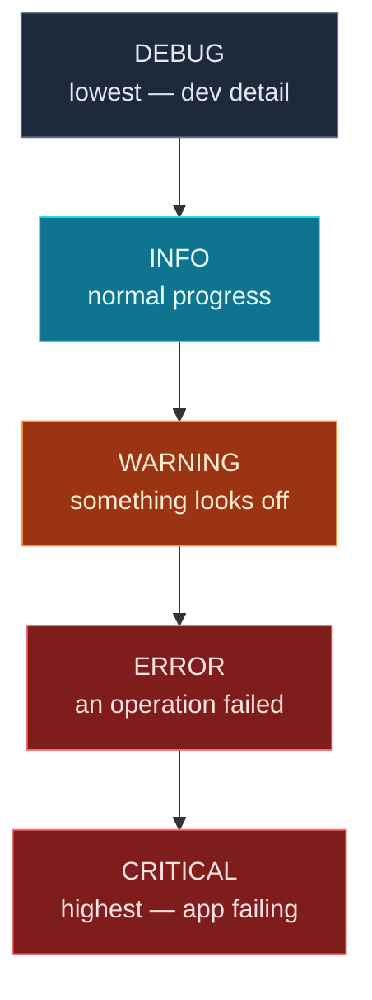

Yesterday you learned to *catch* failures. The other half of robustness is *seeing* what your program is doing — especially when something goes wrong inside code that's too big to trace in your head. Today is about **observability and debugging**: Python's proper **`logging`** module (with severity levels you can dial up or down), how to **read a traceback** like a map straight to the broken line, and the practical habits that turn "it's broken and I have no idea why" into a five-minute fix.

You'll instrument a real order-processing script with logging, then read a multi-level traceback to pinpoint a bug. These are the everyday skills of working on real software — and they matter doubly for AI and API code, where failures are frequent and often far from where they're caused.

> **A member lesson.** Print-debugging gets you surprisingly far, but logging and traceback-reading are what professionals actually rely on. Run every example.

---

## Why not just use `print()`?

`print()` is for a program's *output* — the result a user wants. Using it to understand what your code is *doing* has real problems: every message looks the same (no notion of "just info" vs "serious error"), you can't switch them off without deleting them, there are no timestamps, and your diagnostics get tangled up with real output. For anything beyond a quick check, Python's **`logging`** module is the right tool.

```python
import logging
logging.basicConfig(level=logging.DEBUG, format="%(levelname)s: %(message)s")

logging.debug("detailed diagnostic")
logging.info("things are working")
logging.warning("something looks off")
logging.error("an operation failed")
logging.critical("the app is down")
```

**Output:**

```text
DEBUG: detailed diagnostic
INFO: things are working
WARNING: something looks off
ERROR: an operation failed
CRITICAL: the app is down
```

Two lines of setup and you have **five severity levels**, each tagged so you can tell at a glance how serious a message is. `basicConfig` configures logging once (call it near the top of your program); `format` controls what each line looks like.

---

## Severity levels and the threshold

The five levels go from least to most serious: **DEBUG → INFO → WARNING → ERROR → CRITICAL**. The magic is the **threshold**: you set a level, and only messages *at or above* it are shown — everything below is silently dropped. That's how you dial the noise up while developing and down in production, **without deleting a single line**:

```python
import logging
logging.basicConfig(format="%(levelname)s: %(message)s")  # no level set

logging.info("you will NOT see this")     # INFO is below the default
logging.warning("but you WILL see this")
```

**Output:**

```text
WARNING: but you WILL see this
```

The `info` call produced nothing because **the default threshold is `WARNING`** — a classic "why aren't my logs showing?" gotcha. Set `level=logging.INFO` (or `DEBUG`) in `basicConfig` to see the quieter messages. In development you'll often run at `DEBUG`; in production at `INFO` or `WARNING`.

> **Use lazy `%`-style arguments.** Write `logging.info("Processed %d orders", count)` rather than an f-string. Logging only builds the final string *if* the message will actually be shown — so at a higher threshold, the work is skipped entirely. (You'll see this style in the project.)

### A logger per module

In real programs, instead of calling `logging.info` directly, you create a **named logger** at the top of each file:

```python
import logging
logger = logging.getLogger(__name__)    # named after the module
logger.info("...")
```

Using `__name__` (Day 6!) names the logger after its module, so your logs say *where* each message came from — invaluable in a multi-file program. That's exactly what the project does.

---

## Logging exceptions

Inside an `except` block, **`logging.exception(...)`** logs an ERROR message **plus the full traceback** — so you record not just *that* something failed but *exactly where*:

```python
import logging
logging.basicConfig(level=logging.INFO, format="%(levelname)s: %(message)s")

try:
    1 / 0
except ZeroDivisionError:
    logging.exception("math went wrong")
```

**Output:**

```text
ERROR: math went wrong
Traceback (most recent call last):
  File "<string>", line 5, in <module>
ZeroDivisionError: division by zero
```

This combines Day 13 (catch the error) with today (record it usefully) — you handle the failure *and* keep a detailed record for later. (Call `logging.exception` only *inside* an `except`; elsewhere there's no active exception and it logs an unhelpful `NoneType: None`.)

---

## Reading a traceback

When an uncaught error does occur, Python prints a **traceback** — and it's a map, not a wall of noise, once you know how to read it. The golden rule: **read it from the bottom up.** Here's one from a buggy script:

```text
Traceback (most recent call last):
  File "buggy.py", line 8, in <module>
    report([])
  File "buggy.py", line 5, in report
    avg = average(scores)
  File "buggy.py", line 2, in average
    return sum(numbers) / len(numbers)
ZeroDivisionError: division by zero
```

Read it like this:

1. **Start at the very last line** — it names the exception and message: `ZeroDivisionError: division by zero`. *That's what went wrong.*
2. **Look at the frame just above it** — the bottom-most `File ... line ...`: line 2 in `average`, `return sum(numbers) / len(numbers)`. *That's where it went wrong* — `len(numbers)` was `0`.
3. **Read upward to see how you got there** — `average` was called by `report` (line 5), which was called at the top level (line 8, `report([])`). *That's the path that led here* — someone passed an empty list.

So the bug is at the bottom (dividing by `len([])`), but the *cause* is up the chain (the empty list passed in at line 8). The fix could go in either place — guard against an empty list in `average`, or don't call `report([])`. **The exception and the broken line are at the bottom; the story of how you got there reads upward.** (Python also underlines the exact sub-expression with `^^^` markers, which narrows it further; your file path will be your own.)

---

## Practical debugging techniques

Beyond tracebacks, a few habits find bugs fast:

- **Log (don't print) your way through.** Sprinkle `logger.debug(...)` to see values and flow, then turn them off by raising the threshold — no deleting.
- **`breakpoint()`** — drop this one line anywhere and running the program *pauses* there in an interactive debugger (`pdb`), where you can inspect variables, step line by line (`n`), and continue (`c`). It's the built-in way to freeze time and look around.
- **Isolate it.** Shrink the problem: comment out code, or run the failing function alone with the exact input that breaks it. A bug you can reproduce in three lines is nearly solved.
- **Read the error literally.** `'NoneType' object has no attribute 'x'` means a variable you expected to be an object is actually `None` — usually a function that returned nothing (Day 5!). The message says exactly what's wrong.
- **Rubber-duck it.** Explain the code out loud, line by line, to anything that'll listen. You'll often hear your own mistake.

---

## The severity ladder



**Reading this diagram:**

This is the five logging levels stacked from **lowest severity at the top** to **highest at the bottom** — the order to memorise: DEBUG, INFO, WARNING, ERROR, CRITICAL.

The **grey DEBUG** box is the chattiest — fine-grained detail useful only while developing (variable values, "entered this function"). **Cyan INFO** records normal, expected events ("processing 4 orders", "done"). **Orange WARNING** flags something off but survivable — a record was skipped, a retry happened. The two **red boxes**, ERROR and CRITICAL, are real failures: ERROR means an operation failed (an exception you caught), CRITICAL means the whole program is going down.

The colours aren't decoration — they mirror how alarmed you should be, and that's exactly what the **threshold** controls. Set the level to `WARNING` and only the orange and red messages appear; the grey and cyan are hidden. Set it to `DEBUG` and you see everything. Same code, different verbosity, controlled by one number.

The takeaway: **pick the level that matches a message's seriousness when you write it, then control how much you see with the threshold** — loud while debugging, quiet in production, no code changes either way.

---

## Build it: an instrumented order processor

Let's instrument a real script — processing a batch of orders, some of them bad — with proper logging at the right levels. Create **`process.py`** in a `day-14` folder:

```python
# process.py — logging in a real script (Day 14)
import logging

logging.basicConfig(
    level=logging.INFO,
    format="%(levelname)s | %(message)s",
)
logger = logging.getLogger(__name__)

orders = [
    {"id": 1, "amount": 50.0},
    {"id": 2, "amount": -10.0},   # invalid: negative
    {"id": 3, "amount": "oops"},  # invalid: not a number
    {"id": 4, "amount": 30.0},
]

def process(order):
    amount = order["amount"]
    if not isinstance(amount, (int, float)):
        raise TypeError(f"amount is not a number: {amount!r}")
    if amount <= 0:
        raise ValueError(f"amount must be positive: {amount}")
    return amount

logger.info("Processing %d orders...", len(orders))
total = 0.0
processed = 0

for order in orders:
    try:
        total += process(order)
        processed += 1
        logger.debug("Order %d ok", order["id"])   # hidden at INFO level
    except (ValueError, TypeError) as e:
        logger.warning("Skipping order %d: %s", order["id"], e)

logger.info("Done. Processed %d/%d orders, total $%.2f", processed, len(orders), total)
```

**Run it** (`python3 process.py` / `python process.py`):

```text
INFO | Processing 4 orders...
WARNING | Skipping order 2: amount must be positive: -10.0
WARNING | Skipping order 3: amount is not a number: 'oops'
INFO | Done. Processed 2/4 orders, total $80.00
```

The logs tell the whole story at a glance: it started, skipped two bad orders (with *why*), and finished with the right total. Now change `level=logging.INFO` to `level=logging.DEBUG` and re-run — the hidden `Order N ok` DEBUG lines appear too. One number, all the detail you want.

### Understanding the code

- **`logging.basicConfig(level=..., format=...)`** sets the threshold (`INFO`) and the line format once, at the top.
- **`logger = logging.getLogger(__name__)`** makes a module-named logger.
- **`logger.info(...)`** records normal progress (start and finish). **`logger.warning(...)`** records each skipped order — survivable problems, not crashes. **`logger.debug(...)`** logs per-order success but is *hidden* at INFO level (it's just dev detail).
- **`logger.warning("Skipping order %d: %s", order["id"], e)`** uses lazy `%`-args, and logs the *caught exception's message* (`e`) so you know exactly why each order failed (Day 13 + Day 14 together).
- **The threshold** means the same code is quiet (INFO) or verbose (DEBUG) with a one-line change — no logging statements added or removed.

---

## Common errors and how to fix them

**1. My log messages don't appear**
Almost always the threshold: the default level is `WARNING`, so `logging.info`/`debug` produce nothing. Add `level=logging.INFO` (or `DEBUG`) to `basicConfig`. Also make sure `basicConfig` is called *before* your first log call.

**2. Every log line appears two (or more) times**
You configured logging more than once — e.g. called `basicConfig` repeatedly or added handlers in a loop. Configure logging exactly once, at program start.

**3. `logging.exception` printed `NoneType: None`**
You called it *outside* an `except` block, so there was no active exception to show a traceback for. Use `logging.exception(...)` only inside `except`; elsewhere use `logging.error(...)`.

**4. I'm reading the traceback from the top and getting confused**
Read it **bottom-up**: the last line is the error; the frame just above it is the broken line; frames read upward show how you got there. The top frame is usually just your program's entry point.

**5. `AttributeError: 'NoneType' object has no attribute '...'`**
A variable you expected to hold an object is actually `None` — most often a function that forgot to `return` (Day 5). Trace back to where that variable was assigned and check what produced it.

**6. Using `print()` for everything in a real program**
`print` has no levels and can't be switched off without edits. Once a script is more than a quick experiment, move diagnostics to `logging` so you can control verbosity and keep them out of real output.

> **Reading tip:** when stuck, make the program *talk*. Raise the log level to DEBUG (or drop in a `breakpoint()`), and let it show you the values it actually has — bugs hide in the gap between what you assume and what's really there.

---

## Recap — what you can do now

You can now see inside your running programs:

- ✅ **`logging`** over `print` — five levels (DEBUG→CRITICAL) and `basicConfig`.
- ✅ **The threshold** — show or hide messages by severity, no code changes.
- ✅ **`%`-style args** and a **per-module logger** with `getLogger(__name__)`.
- ✅ **`logging.exception`** — record an error with its full traceback.
- ✅ **Reading tracebacks** bottom-up to find the error and its cause.
- ✅ **Debugging habits** — `breakpoint()`, isolating, reading errors literally.
- ✅ An **instrumented script** whose logs tell the whole story.

### Day 14 cheat sheet

| Want to… | Write |
|---|---|
| Set up logging | `logging.basicConfig(level=logging.INFO)` |
| A module logger | `logger = logging.getLogger(__name__)` |
| Log at each level | `logger.debug/info/warning/error/critical(...)` |
| Lazy formatting | `logger.info("got %d", n)` |
| Log an exception + traceback | `logger.exception("msg")` (in `except`) |
| Pause in a debugger | `breakpoint()` |
| Read a traceback | bottom-up: error → broken line → callers |
| Default level (gotcha) | `WARNING` (info/debug hidden) |

---

## Coming up on Day 15

Your programs can now handle and report failure. Day 15 closes Module 4 with the other thing real programs do constantly: **work with files**. You'll read and write **text files**, save and load **JSON** (the `json` module from Day 8, now to disk), and load configuration and secrets from **`.env` files** — the standard, safe way to keep API keys out of your code, which you'll need the moment you start calling APIs and LLMs. You'll turn an in-memory app into one that *remembers* between runs.

You've learned to observe your programs. Next, we give them persistence. See the full roadmap on the [Python for AI Engineering series page](/series/python-for-ai-engineering).

**See you on Day 15.** 🐍
