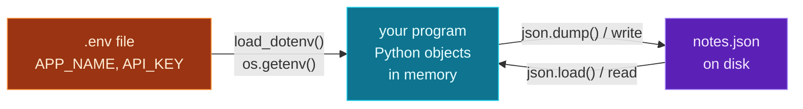

Every program you've built so far forgets everything the moment it stops. Close it, and the contacts, the notes, the leaderboard — all gone. To *remember* between runs, a program reads and writes **files**, and that's the last piece of Module 4.

Today you'll read and write **text files**, save and load structured data as **JSON** on disk (the `json` module from Day 8, now to a file), and load configuration and **secrets from `.env` files** — the standard, secure way to keep API keys out of your code, which you'll need the moment you start calling APIs and LLMs next module. You'll turn an in-memory notes app into one that survives a restart.

> **A member lesson — Module 4 finale.** This day also introduces your **first third-party package** (`python-dotenv`) with a quick `pip install`. Don't worry about the details of pip and virtual environments — they get their own full day *tomorrow* (Day 16). Today, just run the one install command and follow along.

---

## Reading and writing text files

You open a file with **`open(path, mode)`**, and the best way to use it is the **`with`** statement. The three modes you need: **`"r"`** read (the default), **`"w"`** write (creates or replaces), **`"a"`** append (adds to the end).

```python
with open("hello.txt", "w") as f:    # "w" → create/overwrite for writing
    f.write("Hello, file!\n")
    f.write("Second line.\n")

with open("hello.txt") as f:         # no mode → "r" (read)
    content = f.read()
print(content)
```

**Output:**

```text
Hello, file!
Second line.
```

`f.write(...)` writes a string (note the `\n` — `write` doesn't add line breaks for you). `f.read()` reads the whole file into one string. The `\n` from Day 2 is doing real work here: it's what separates the lines on disk.

To read a file **line by line** — the memory-friendly way for big files — just loop over it:

```python
with open("hello.txt") as f:
    for line in f:
        print(line.strip())     # .strip() removes the trailing newline
```

**Output:**

```text
Hello, file!
Second line.
```

### Why `with`? And the `"w"` trap

The **`with`** statement is a *context manager*: it guarantees the file is **closed automatically** when the block ends — even if an error is raised inside (it's the clean version of the `finally` cleanup from Day 13). Always use `with` for files; forgetting to close a file can mean your writes never actually hit the disk.

One trap to burn in: **opening a file in `"w"` mode erases its contents immediately** — before you write anything. If you want to *add* to a file, use **`"a"`** (append), not `"w"`:

```python
with open("hello.txt", "a") as f:    # "a" → keep existing, add to the end
    f.write("Appended line.\n")
```

After this, `hello.txt` has three lines. Reopening it in `"w"` would have wiped the first two. (We'll show the truncation trap in the errors section.)

---

## Paths the modern way: `pathlib`

Manipulating file paths as plain strings gets messy. Python's **`pathlib`** gives you a clean `Path` object with handy methods — and it's the modern standard:

```python
from pathlib import Path

p = Path("hello.txt")
print(p.exists())        # is the file there?  → True
print(p.read_text())     # read the whole file in one call
```

`Path("hello.txt").read_text()` is a one-line shortcut for open-read-close, and `p.write_text("...")` is the write equivalent. `p.exists()` checks for a file before you try to open it — exactly what you need to decide "load existing data, or start fresh," which the project uses.

---

## JSON to and from disk

On Day 8 you converted JSON *strings* with `json.loads`/`json.dumps`. To work with JSON *files* there are two file-based twins: **`json.dump(obj, file)`** writes a Python object to an open file, and **`json.load(file)`** reads one back:

```python
import json

data = {"name": "Ada", "tags": ["x", "y"]}

with open("data.json", "w") as f:
    json.dump(data, f, indent=2)     # write Python → JSON file

with open("data.json") as f:
    loaded = json.load(f)            # read JSON file → Python
print(loaded["name"], loaded["tags"])
```

**Output:**

```text
Ada ['x', 'y']
```

Remember the difference: the **`s`** versions work with *strings* (`dumps`/`loads`), the plain versions work with *files* (`dump`/`load`). `indent=2` makes the saved file human-readable. This is the easiest way to give a program persistent, structured memory — and it's exactly how the notes app saves your notes.

---

## `.env` files: configuration and secrets, kept safe

Programs need settings — and some of those are **secrets**, like API keys. There's one rule that matters enormously: **never hard-code secrets in your source code.** Code gets committed to Git, shared, and pushed to GitHub; a key written in a `.py` file leaks the moment you share it. (Real API keys have been stolen from public repos within *minutes*.)

The standard solution is a **`.env`** file — a simple `KEY=value` text file that lives next to your code but is **never committed** (you add it to `.gitignore`). Your program reads values from it at startup. The popular tool for this is **`python-dotenv`**. Install it (your first `pip install` — more tomorrow):

```bash
pip install python-dotenv
```

Create a **`.env`** file:

> File: `.env`
> ```
> APP_NAME=My Notes
> API_KEY=sk-demo-12345
> ```

Then load it and read values with **`os.getenv`** (which takes a default for when a key is missing):

```python
from dotenv import load_dotenv
import os

load_dotenv()                              # read .env into the environment
api_key = os.getenv("API_KEY", "default")  # read a value, with a fallback
print(api_key)
```

**Output:**

```text
sk-demo-12345
```

`load_dotenv()` loads the `.env` file's keys into the environment; `os.getenv("API_KEY")` reads one back. Your code references `os.getenv("API_KEY")` — the secret itself stays in the uncommitted `.env`. This is the **exact pattern** you'll use to hold your Claude/OpenAI/Gemini keys when you start calling LLMs in Module 9. **Always add `.env` to your `.gitignore`** so it never gets committed.

---

## The persistence cycle



**Reading this diagram:**

Three pieces, and the arrows show how data moves between them.

On the left, the **orange `.env` box** holds configuration and secrets. The arrow into the program is labelled `load_dotenv()` / `os.getenv()`: at startup, your program pulls these values *in* — but only reads them, and they never live in your code. This flow runs once, at the beginning.

In the middle, the **cyan box** is your running program — Python objects (a list of note dicts) held in **memory**. Memory is fast but temporary: it vanishes when the program stops.

On the right, the **purple `notes.json` box** is the file on **disk** — permanent storage. The two arrows between the program and the disk are the heart of persistence: `json.dump()` **writes** the in-memory data out to the file (so it survives), and `json.load()` **reads** it back the next time the program starts (so it remembers). 

The takeaway: **secrets flow in from `.env`; data cycles out to disk and back via `json.dump`/`json.load`.** That round trip — load on start, save on change — is how every app that "remembers" works, from this notes script to a full database-backed service.

---

## Build it: a notes app that remembers

Let's tie it together: a notes app that loads its config from `.env` and persists its notes to a JSON file. Two files in a `day-15` folder.

First, install the one dependency and create the **`.env`**:

```bash
pip install python-dotenv
```

> File: `.env`
> ```
> APP_NAME=My Notes
> API_KEY=sk-demo-12345
> ```

Then **`notes.py`**:

```python
# notes.py — text, JSON & .env files (Day 15)
import json
import os
from pathlib import Path
from dotenv import load_dotenv

# 1) Load config & secrets from a .env file (never hard-code these!)
load_dotenv()
APP_NAME = os.getenv("APP_NAME", "Notes")
API_KEY = os.getenv("API_KEY", "(not set)")

DATA_FILE = Path("notes.json")

def load_notes():
    """Read notes from disk, or start fresh if the file doesn't exist."""
    if DATA_FILE.exists():
        with open(DATA_FILE) as f:
            return json.load(f)
    return []

def save_notes(notes):
    """Write notes to disk as pretty JSON."""
    with open(DATA_FILE, "w") as f:
        json.dump(notes, f, indent=2)

# --- using it ---
print(f"{APP_NAME} (API key: {API_KEY})")

notes = load_notes()
print(f"Loaded {len(notes)} existing notes.")

notes.append({"id": len(notes) + 1, "text": "Buy milk"})
notes.append({"id": len(notes) + 1, "text": "Finish Day 15"})
save_notes(notes)
print(f"Saved {len(notes)} notes to {DATA_FILE}.")

print("\nFile contents:")
print(DATA_FILE.read_text())
```

**Run it** (`python3 notes.py` / `python notes.py`). The first run:

```text
My Notes (API key: sk-demo-12345)
Loaded 0 existing notes.
Saved 2 notes to notes.json.

File contents:
[
  {
    "id": 1,
    "text": "Buy milk"
  },
  {
    "id": 2,
    "text": "Finish Day 15"
  }
]
```

Now run it **again**. This time it loads the 2 notes it saved last time and adds 2 more:

```text
My Notes (API key: sk-demo-12345)
Loaded 2 existing notes.
Saved 4 notes to notes.json.
...
```

That's persistence — the app *remembers* across runs, because its state lives in `notes.json`. And its config came from `.env`, with no secrets in the code.

### Understanding the code

- **`load_dotenv()` + `os.getenv(...)`** pull `APP_NAME` and `API_KEY` from `.env`, each with a sensible default if missing. The secret never appears in `notes.py`.
- **`DATA_FILE = Path("notes.json")`** — a `pathlib` path used throughout.
- **`load_notes()`** checks `DATA_FILE.exists()`: if the file is there, it `json.load`s the notes; if not (first run), it returns an empty list. That `exists()` check is what makes the first run work.
- **`save_notes()`** uses `with open(..., "w")` and `json.dump(..., indent=2)` to write the notes as readable JSON.
- **`DATA_FILE.read_text()`** reads the raw file back so you can *see* what persisted.
- Because state is saved to disk and loaded on startup, the note count **grows every run** — the whole point.

---

## Common errors and how to fix them

**1. `FileNotFoundError: [Errno 2] No such file or directory: '...'`**
You opened a file for reading (`"r"`) that doesn't exist — often a typo in the path, or expecting a file that hasn't been created yet. Check the name, and guard reads with `if Path(name).exists():` (as the project does) when the file might be absent.

**2. `json.decoder.JSONDecodeError: Expecting value: line 1 column 1 (char 0)`**
You `json.load`ed a file that's **empty or corrupt** — commonly a file that was created but never written to. Make sure valid JSON was written (an empty file isn't valid JSON). When unsure, wrap the load in `try`/`except json.JSONDecodeError` (Day 13) and fall back to a default.

**3. `ModuleNotFoundError: No module named 'dotenv'`**
You haven't installed `python-dotenv` (or you're not in the environment where you installed it). Run `pip install python-dotenv`. The package is `python-dotenv`, but you import it as `dotenv` — a common name mismatch. (Environments are Day 16's topic.)

**4. My file is empty / my old data disappeared**
You opened it in `"w"` mode, which **erases the file the instant you open it**. To add without destroying, use `"a"` (append); to update structured data, load it, change it in memory, and write the whole thing back (the load-modify-save pattern the project uses).

**5. My writes didn't show up in the file**
You probably didn't use `with` (and didn't close the file), so the buffered data was never flushed to disk. Always use `with open(...) as f:` — it closes and flushes automatically at the end of the block.

**6. My API key ended up on GitHub**
You committed your `.env` (or hard-coded the key). Add `.env` to `.gitignore` *before* your first commit, and never put secrets in `.py` files. If a key is ever exposed, rotate it (revoke and regenerate) immediately.

> **Reading tip:** file errors name the exact path and reason. `FileNotFoundError` → wrong path or missing file; `JSONDecodeError` → the file isn't valid JSON; `PermissionError` → you can't write there. The path in the message is your first clue.

---

## Recap — Module 4 complete 🎉

You can now write programs that persist and stay robust:

- ✅ **Text files** — `with open(path, mode)`, modes `r`/`w`/`a`, write/read/iterate lines.
- ✅ **`with`** (context managers) — guaranteed close, even on error.
- ✅ **`pathlib`** — `Path`, `.exists()`, `.read_text()`/`.write_text()`.
- ✅ **JSON files** — `json.dump`/`json.load` (files) vs `dumps`/`loads` (strings).
- ✅ **`.env` & secrets** — `python-dotenv`, `load_dotenv` + `os.getenv`, and `.gitignore`-ing your `.env`.
- ✅ A **notes app that remembers** across runs.

That completes Module 4 — your code now handles errors, logs what it's doing, and persists its state. It's real software.

### Day 15 cheat sheet

| Want to… | Write |
|---|---|
| Write a text file | `with open(p, "w") as f: f.write(s)` |
| Read it all | `with open(p) as f: f.read()` |
| Read line by line | `for line in f:` |
| Append (don't erase) | `open(p, "a")` |
| Path shortcuts | `Path(p).read_text()` / `.exists()` |
| Save JSON to a file | `json.dump(obj, f, indent=2)` |
| Load JSON from a file | `json.load(f)` |
| Load secrets | `load_dotenv()` then `os.getenv("KEY")` |
| Keep secrets safe | add `.env` to `.gitignore` |

---

## Coming up on Day 16 — a new module begins

You just ran your first `pip install` — and tomorrow we make that rock-solid. **Module 5** is **Environments & Project Structure**, and Day 16 gives **virtual environments, `pip`, and a clean project layout** their full treatment: why every project needs its own isolated environment, how `pip` and `requirements.txt` manage dependencies reproducibly, and how to structure a real Python project. It's the professional setup that makes everything from here — APIs, Pydantic, async, NumPy — install cleanly and work the same on any machine.

You've learned to persist data. Next, we make your whole project portable and reproducible. See the full roadmap on the [Python for AI Engineering series page](/series/python-for-ai-engineering).

**See you on Day 16.** 🐍
