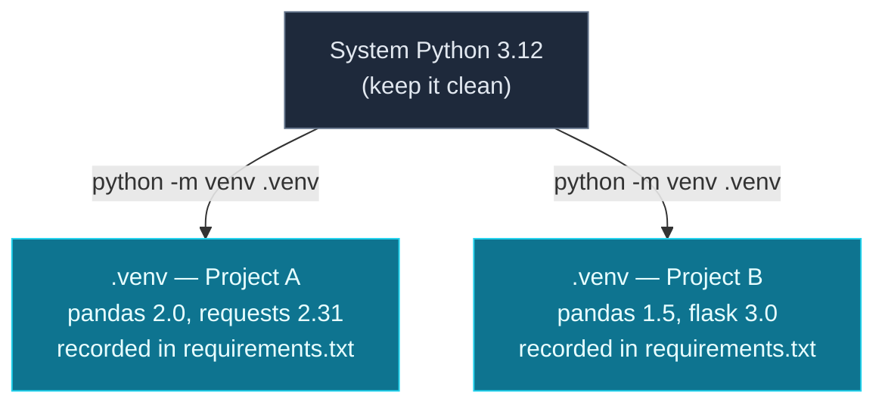

On Day 15 you ran your first `pip install`. Today we make that professional. **Module 5 — Environments & Project Structure** is about the setup that everything ahead depends on: APIs, Pydantic, async, NumPy and Pandas all get installed and organised the way you'll learn now. Get this right once and every future project "just works" on any machine.

Three connected skills: **virtual environments** (an isolated package sandbox per project), **`pip` and `requirements.txt`** (installing and *recording* dependencies so anyone can reproduce them), and **project structure** (laying out files so a growing project stays sane). You'll package the to-do app into a clean, portable project.

> **A member lesson.** You met venvs briefly on Day 1; today they finally make complete sense. This is the most "professional setup" day of the series — and the foundation for the AI tooling coming up. Follow along in a terminal.

---

## The problem: one global Python, many projects

When you `pip install` a package without a virtual environment, it goes into your **system Python** — shared by *every* project on your computer. That breaks down fast: Project A needs `pandas` 2.0, Project B still runs on `pandas` 1.5, and they can't both win. Install one and you break the other. This is "dependency hell," and it's why **every serious Python project gets its own isolated environment**.



**Reading this diagram:**

At the top, the **grey box** is your **system Python** — the one that came with your OS or that you installed on Day 1. The golden rule it represents: *keep it clean.* You don't install project packages here, because everything would pile into one shared pool.

The two **cyan boxes** are **virtual environments** — one per project, each created with `python -m venv .venv`. Each is a self-contained folder (`.venv`) with its *own* copy of pip and its *own* installed packages. Project A's `.venv` can hold `pandas` 2.0 while Project B's holds `pandas` 1.5, and they never see or break each other. That's **isolation**.

The note under each box — *recorded in `requirements.txt`* — is the other half of the story: each environment's exact contents are written down in a file, so the same set of packages can be **reproduced** on any machine. 

The takeaway: **system Python stays clean; each project gets its own `.venv`; `requirements.txt` records what's inside.** Isolation prevents conflicts; the requirements file makes it reproducible.

---

## Creating and activating a virtual environment

You saw these on Day 1; here's the full reference. From inside your project folder, create the environment (a hidden `.venv` folder), then **activate** it:

**macOS / Linux:**

```bash
python3 -m venv .venv
source .venv/bin/activate
```

**Windows (PowerShell):**

```powershell
python -m venv .venv
.venv\Scripts\Activate.ps1
```

Once active, your prompt shows **`(.venv)`** and `python`/`pip` now point *inside* the environment. You can prove it:

```bash
which python      # macOS/Linux  (Windows: where python)
```

```text
~/todo_app/.venv/bin/python
```

That path — inside your project's `.venv`, not the system location — is the whole point: anything you install now lands in this sandbox. Type **`deactivate`** to leave. (Windows PowerShell hiccup with activation? Re-read Day 1's `Set-ExecutionPolicy` fix.)

---

## pip: installing packages

With the environment active, **`pip`** installs packages from PyPI (the Python Package Index — hundreds of thousands of libraries). The commands you'll use:

```bash
pip install python-dotenv          # install the latest
pip install "pandas==2.0.3"        # install an exact version
pip list                           # what's installed
pip show python-dotenv             # details about one package
pip uninstall python-dotenv        # remove one
```

`pip list` after installing shows your environment's contents:

```text
Package       Version
------------- -------
pip           24.0
python-dotenv 1.2.2
```

Pinning an exact version with `==` matters for reproducibility — "the latest" changes over time, and you want everyone (and future-you) on the *same* version.

---

## requirements.txt: reproducible dependencies

How does a teammate — or a server, or you on a new laptop — get the *exact same* packages? You **record** them. **`pip freeze`** prints every installed package with its exact version; redirect it into **`requirements.txt`**:

```bash
pip freeze > requirements.txt
```

```text
python-dotenv==1.2.2
```

Commit that file (it's small and text). Then anyone can recreate the environment with one command:

```bash
pip install -r requirements.txt
```

This is the contract of a reproducible project: **`requirements.txt` lists exactly what's needed, and `-r` installs it all.** Re-run it any time you add a package (`pip install X` then `pip freeze > requirements.txt`). It's how your project runs identically on every machine.

---

## A real project structure

As a project grows past one file, you organise it. Here's the layout for our to-do app — a **package** (a folder of related modules, Day 6) plus an entry point and the project files:

```text
todo_app/
├── .env                ← config & secrets (never committed)
├── .gitignore          ← what Git should ignore
├── .venv/              ← the virtual environment (never committed)
├── main.py             ← the entry point you run
├── requirements.txt    ← the recorded dependencies
└── todo/               ← your package (a folder of modules)
    ├── __init__.py     ← marks "todo" as a package
    └── storage.py      ← the load/save logic
```

Two things to note. The **`todo/` folder with an `__init__.py`** is a *package* — a directory Python treats as importable, so `main.py` can do `from todo import storage`. (`__init__.py` can be empty; its presence is what matters.) And the **`.gitignore`** keeps junk and secrets out of version control:

> File: `.gitignore`
> ```
> .venv/
> .env
> __pycache__/
> *.pyc
> todos.json
> ```

You **never commit `.venv/`** (it's big — ours is 16 MB — and machine-specific; `requirements.txt` replaces it), never commit `.env` (secrets, Day 15), and skip Python's auto-generated `__pycache__/` and `.pyc` files.

---

## Build it: package the to-do app

Let's assemble the whole thing. Create the structure, the environment, and the files.

**1) Make the folders and the environment:**

```bash
mkdir -p todo_app/todo && cd todo_app
python3 -m venv .venv && source .venv/bin/activate    # Windows: .venv\Scripts\Activate.ps1
pip install python-dotenv
pip freeze > requirements.txt
```

**2) The package module — `todo/storage.py`:**

```python
import json
from pathlib import Path

DATA_FILE = Path("todos.json")

def load():
    if DATA_FILE.exists():
        return json.loads(DATA_FILE.read_text())
    return []

def add(todos, task):
    todos.append({"id": len(todos) + 1, "task": task, "done": False})

def save(todos):
    DATA_FILE.write_text(json.dumps(todos, indent=2))
```

**3) An empty `todo/__init__.py`** (create the file; it can be empty — it just marks the folder as a package):

```python
# todo/__init__.py — this file makes `todo` an importable package.
```

**4) The entry point — `main.py`:**

```python
import os
from dotenv import load_dotenv
from todo import storage

load_dotenv()
APP_NAME = os.getenv("APP_NAME", "Todo")

def main():
    print(f"=== {APP_NAME} ===")
    todos = storage.load()
    storage.add(todos, "Learn virtual environments")
    storage.add(todos, "Write requirements.txt")
    storage.save(todos)
    print(f"{len(todos)} tasks saved.")
    for t in todos:
        mark = "x" if t["done"] else " "
        print(f"  [{mark}] {t['id']}. {t['task']}")

if __name__ == "__main__":
    main()
```

**5) The `.env`:**

> File: `.env`
> ```
> APP_NAME=My Tasks
> ```

**Run it** from the `todo_app` folder (`python main.py`):

```text
=== My Tasks ===
2 tasks saved.
  [ ] 1. Learn virtual environments
  [ ] 2. Write requirements.txt
```

It works — config from `.env`, logic in the `todo` package, dependencies recorded in `requirements.txt`. Now `requirements.txt` + the two `.py` files are all anyone needs to reproduce your project: clone, `python -m venv .venv`, activate, `pip install -r requirements.txt`, `python main.py`. That portability is the whole point of this day.

### Understanding the structure

- **`.venv/`** holds the isolated packages — created locally, never committed, rebuilt from `requirements.txt`.
- **`requirements.txt`** is the single source of truth for dependencies — the one file that makes the project reproducible.
- **`todo/` (with `__init__.py`)** is a package; `main.py` imports it with `from todo import storage` (Day 6 modules, now folder-organised).
- **`main.py`** is the entry point, guarded by `if __name__ == "__main__":` so it runs as a program but stays importable.
- **`.gitignore`** keeps `.venv`, `.env`, caches, and the generated `todos.json` out of Git.

This is the skeleton of essentially every Python project you'll build from here.

---

## Common errors and how to fix them

**1. `ModuleNotFoundError: No module named 'dotenv'` even though you installed it**
You're not in the virtual environment where you installed it — the prompt isn't showing `(.venv)`. Activate it (`source .venv/bin/activate` / `.venv\Scripts\Activate.ps1`) *before* running, and install *after* activating. Check `which python` points inside `.venv`.

**2. Your data file appears in the wrong place**
`Path("todos.json")` is relative to **where you run the program from** (the current directory), not where the script lives. Run from the project root (as the example does), or build an absolute path from the script's location if you need it anchored.

**3. `pip install` says "Defaulting to user installation" or needs admin rights**
You're installing into system Python without a venv. Create and activate a virtual environment first — you should never need admin rights to `pip install` inside one.

**4. You committed `.venv/` and your repo is huge**
The `.venv` folder is large and machine-specific. Add `.venv/` to `.gitignore` (before committing), and share `requirements.txt` instead — it recreates the environment anywhere.

**5. A teammate's `pip install -r requirements.txt` is missing a package**
You installed something but forgot to update the file. After any `pip install`, re-run `pip freeze > requirements.txt` and commit it. The file only knows what you record in it.

**6. `source: command not found` / activation does nothing (Windows)**
`source` is a macOS/Linux command. On Windows use `.venv\Scripts\Activate.ps1` (PowerShell) or `.venv\Scripts\activate.bat` (Command Prompt). If PowerShell blocks the script, apply the `Set-ExecutionPolicy` fix from Day 1.

> **Reading tip:** almost every "it worked yesterday / works for me but not them" packaging problem is an environment mismatch. First check: is the right `.venv` active (`which python`), and is `requirements.txt` current?

---

## Recap — Module 5 complete 🎉

You can now set up projects like a professional:

- ✅ **Virtual environments** — `python -m venv .venv`, activate/deactivate, one isolated sandbox per project.
- ✅ **`pip`** — install, pin versions with `==`, `list`, `show`, `uninstall`.
- ✅ **`requirements.txt`** — `pip freeze >` to record, `pip install -r` to reproduce.
- ✅ **Project structure** — a package with `__init__.py`, an entry point, and a `.gitignore`.
- ✅ **What never to commit** — `.venv/`, `.env`, caches.
- ✅ A **packaged, portable to-do app** anyone can reproduce.

### Day 16 cheat sheet

| Want to… | Run |
|---|---|
| Create an environment | `python -m venv .venv` |
| Activate (mac/Linux) | `source .venv/bin/activate` |
| Activate (Windows) | `.venv\Scripts\Activate.ps1` |
| Leave it | `deactivate` |
| Install a package | `pip install name` |
| Pin a version | `pip install "name==1.2.3"` |
| Record dependencies | `pip freeze > requirements.txt` |
| Reproduce them | `pip install -r requirements.txt` |
| Make a package | folder + empty `__init__.py` |

---

## Coming up on Day 17 — a new module begins

Your projects are now organised and reproducible. **Module 6 is Type Safety**, and Day 17 introduces **type hints** — annotations like `def greet(name: str) -> str:` that document exactly what your functions expect and return. You'll learn the syntax (`str`, `int`, `list[int]`, `Optional`, `Union`) and run **mypy**, a tool that *checks* your types and catches a whole class of bugs *before* you ever run the code. It's the first half of the professionalism that makes AI codebases maintainable.

You've made your project portable. Next, we make it provably correct. See the full roadmap on the [Python for AI Engineering series page](/series/python-for-ai-engineering).

**See you on Day 17.** 🐍
