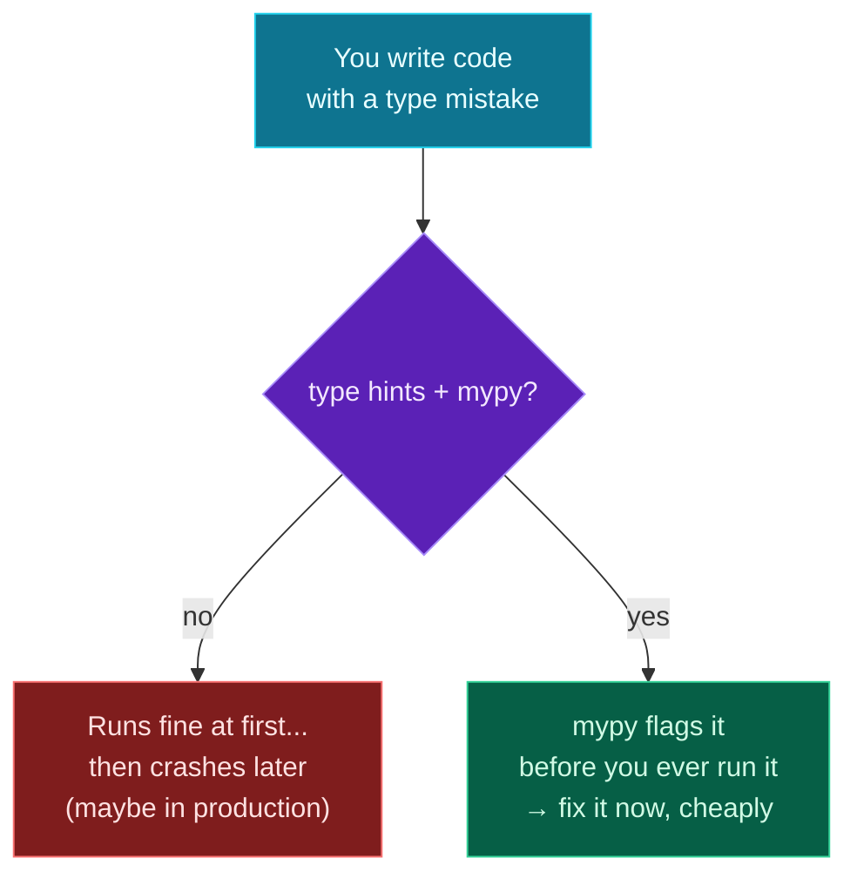

Welcome to **Module 6 — Type Safety**. Python lets you put *anything* in *any* variable, which is wonderfully flexible — and a source of subtle bugs. A function that expects a list quietly gets a string; a value that might be `None` gets used as if it never is; and you find out only when it crashes, often far from the cause.

**Type hints** fix this. They're annotations — `def greet(name: str) -> str:` — that document exactly what a function expects and returns. Python itself ignores them at runtime, but tools like **mypy** read them and check your whole program *without running it*, catching type mistakes before they ever become crashes. Today you'll learn the syntax and run mypy on real code. This is a cornerstone of professional and AI Python — every serious codebase (and Pydantic, tomorrow) is built on it.

> **A member lesson.** Type hints feel optional until the first time mypy saves you from a 2 a.m. production bug. They also make editors smarter (autocomplete, inline errors). Install mypy and run every check yourself.

---

## Basic type hints

A type hint is a `: type` after a variable or parameter, and `-> type` for a function's return. Here's the shape:

```python
name: str = "Ada"
age: int = 36
height: float = 1.75
is_member: bool = True

def greet(name: str) -> str:
    return f"Hello, {name}"

print(greet("Ada"))
```

**Output:**

```text
Hello, Ada
```

`def greet(name: str) -> str:` reads: "takes a `name` that should be a `str`, returns a `str`." The hints don't change what the code *does* — `greet` works exactly as before. They document intent for humans and tools, and that documentation is *checkable*.

### Hints are not enforced at runtime

This surprises everyone: Python **ignores** type hints when it runs. Pass the wrong type and it happily proceeds:

```python
def double(n: int) -> int:
    return n * 2

print(double("hi"))    # the hint says int, but...
```

**Output:**

```text
hihi
```

`double("hi")` runs and prints `hihi` (string repetition from Day 2) — Python never checked the `int` hint. So what *are* hints good for? A separate tool reads them and checks your code **before** you run it. That tool is mypy, and it's the whole point of this day.

---

## Typing collections, Optional, and Union

Hints get specific about collections. Use lowercase built-in names with `[ ]` for the contents (modern Python, 3.9+):

```python
nums: list[int] = [1, 2, 3]
prices: dict[str, float] = {"apple": 0.5}
point: tuple[int, int] = (3, 4)
```

`list[int]` is "a list of ints," `dict[str, float]` is "a dict with string keys and float values." Two more you'll use constantly:

- **A value that might be `None`** — write `int | None` (a value that's an `int` *or* `None`). This is how you type the result of `dict.get()`, which returns `None` when the key is missing.
- **A value that could be one of several types** — write `int | str` (an `int` *or* a `str`). This is a **union**.

```python
def find_user(users: dict[str, int], name: str) -> int | None:
    return users.get(name)     # an int if found, None if not
```

(In older code you'll see `Optional[int]` and `Union[int, str]` from the `typing` module — same meaning; the `|` syntax is the modern, cleaner form.)

---

## mypy: checking types before you run

**mypy** is a *static type checker* — it reads your hints and analyses your code for type mistakes without executing it. Install it (in your venv, Day 16):

```bash
pip install mypy
```

Then point it at a file. On well-typed code it's quiet:

```bash
mypy stats.py
```

```text
Success: no issues found in 1 source file
```

Now watch it catch real bugs. Here's a file with two type mistakes:

```python
def mean(numbers: list[float]) -> float:
    return sum(numbers) / len(numbers)

result: int = mean([1.0, 2.0])    # float assigned to an int variable
print(mean("not a list"))         # a string is not list[float]
```

Run `mypy bug.py`:

```text
bug.py:4: error: Incompatible types in assignment (expression has type "float", variable has type "int")  [assignment]
bug.py:5: error: Argument 1 to "mean" has incompatible type "str"; expected "list[float]"  [arg-type]
Found 2 errors in 1 file (checked 1 source file)
```

mypy found both — the file:line, what's wrong, and the expected vs actual type — **without running the code**. The real power shows with `None`. This looks innocent:

```python
def find_user(users: dict[str, int], name: str) -> int | None:
    return users.get(name)

uid = find_user({"Ada": 1}, "Bob")   # "Bob" is missing → None
print(uid + 1)                        # adding to a possible None
```

```text
optional_bug.py:5: error: Unsupported operand types for + ("None" and "int")  [operator]
optional_bug.py:5: note: Left operand is of type "int | None"
```

mypy knows `find_user` can return `None`, so it flags `uid + 1` as unsafe — and it's right: run that code and it crashes with `TypeError: unsupported operand type(s) for +: 'NoneType' and 'int'`. **mypy caught at check-time the exact bug that would have crashed at runtime.** The fix is to handle the `None` (`if uid is not None: ...`) — and mypy *makes* you remember to.

---

## Why type safety matters for AI

Type hints aren't bureaucracy — they're especially valuable in data and AI code:

- **Data contracts.** A function typed `def embed(texts: list[str]) -> list[list[float]]:` tells you *exactly* the shape going in and out — invaluable when wiring models, tokenizers, and APIs together.
- **Catch shape bugs early.** Passing a single string where a list of strings is expected is a classic AI-pipeline mistake; mypy flags it before you waste an API call or a training run.
- **Smarter editors.** With hints, your editor autocompletes attributes and warns you inline — you write correct code faster.
- **It's the foundation of Pydantic** (tomorrow), which turns these hints into *runtime validation* of real API and LLM data.

---

## Catch it now, or crash later



**Reading this diagram:**

Both paths start the same way (cyan): you write some code, and it has a type mistake — say, passing a `None` where a number is expected. The purple diamond is the fork: *did you add type hints and run mypy?*

Take the **no** branch and you reach the red box. Because Python ignores hints at runtime, the bug is invisible at first — the program starts, runs a while, and then **crashes later**, possibly deep in production, far from the line that's actually wrong. You debug it the hard way, after it's already caused damage.

Take the **yes** branch and you reach the green box. mypy reads your hints and finds the mistake **before you ever run the program** — it points at the exact file, line, and types. You fix it in seconds, at your desk, before it can hurt anything.

The takeaway — and the whole philosophy of type safety: **type hints + mypy move bugs from "discovered at runtime, expensively" to "caught before running, cheaply."** Same bug, caught much earlier. That shift is why every large Python codebase uses them.

---

## Build it: a type-checked stats module

Let's write a properly typed module and verify it with mypy. Set up a venv and install mypy (Day 16), then create **`stats.py`**:

```bash
python3 -m venv .venv && source .venv/bin/activate    # Windows: .venv\Scripts\Activate.ps1
pip install mypy
```

```python
# stats.py — typed functions (Day 17)

def mean(numbers: list[float]) -> float:
    return sum(numbers) / len(numbers)

def find_user(users: dict[str, int], name: str) -> int | None:
    return users.get(name)

def format_score(name: str, score: float) -> str:
    return f"{name}: {score:.1f}"

scores: list[float] = [88.0, 92.5, 79.0]
print(format_score("Average", mean(scores)))

users: dict[str, int] = {"Ada": 1, "Linus": 2}
uid = find_user(users, "Ada")
print(f"Ada's id: {uid}")
print(f"Missing: {find_user(users, 'Bob')}")
```

**Run it** (`python stats.py`):

```text
Average: 86.5
Ada's id: 1
Missing: None
```

**Now type-check it** (`mypy stats.py`):

```text
Success: no issues found in 1 source file
```

Clean — every function's inputs and outputs line up. Make `mypy <file>` a habit (many teams run it automatically in CI). Try breaking it: change `scores` to `["a", "b", "c"]` and re-run mypy — it'll flag the mismatch instantly, before the code ever runs.

### Understanding the code

- **`mean(numbers: list[float]) -> float`** documents and checks that it takes a list of floats and returns a float.
- **`find_user(...) -> int | None`** is honest about reality: a lookup *can* miss, so the return is `int | None`. mypy then ensures every caller handles the `None` case — exactly the safety net the earlier example showed.
- **`format_score(name: str, score: float) -> str`** — clear inputs, clear output.
- **`scores: list[float]`** and **`users: dict[str, int]`** annotate the variables so mypy can check how they're used downstream.
- **`mypy stats.py`** verifies the *whole* file's type consistency without executing it.

The runtime output and the mypy check are two separate, complementary steps: one proves it *runs*, the other proves it's *type-consistent*.

---

## Common errors and how to fix them

**1. `error: Incompatible types in assignment (expression has type "float", variable has type "int")`**
You assigned a value of one type to a variable annotated as another — e.g. a `float` result into an `int` variable. Fix the annotation to match reality (`result: float`) or convert the value (`int(result)`), whichever you actually meant.

**2. `error: Argument 1 to "mean" has incompatible type "str"; expected "list[float]"`**
You called a function with the wrong type of argument. The message gives expected vs actual — pass the right type (here, a `list[float]`, not a `str`).

**3. `error: Unsupported operand types for + ("None" and "int")`**
You used a value that might be `None` (often a `.get()` result, typed `... | None`) without checking. Guard it first: `if x is not None: ...`, or provide a default so it's never `None`. mypy is protecting you from a real runtime `TypeError`.

**4. `error: Function is missing a return statement` / returning the wrong type**
Your function's body doesn't always return what its `-> type` promises — a path that falls off the end (returns `None`) when you declared `-> int`. Make every path return the right type, or widen the annotation to `int | None` if `None` is legitimate.

**5. `error: Name "List" is not defined` (or needing imports)**
You used the old capital-`List`/`Dict`/`Optional` names without importing them. Either use the modern lowercase built-ins (`list[int]`, `dict[str, int]`, `int | None`) which need no import, or `from typing import List, Optional` for the old style.

**6. "My type hints didn't stop the bad value at runtime"**
They never will — Python ignores hints when running. Hints are checked by mypy *before* running, not enforced *during* it. For runtime validation of external data (API/LLM responses), you need Pydantic — that's tomorrow.

> **Reading tip:** a mypy error always names the file, line, the *expected* type, and the *actual* type. Read "expected X, got Y" literally — the fix is almost always to make one of them match the other.

---

## Recap — what you can do now

You can document and verify your code's types:

- ✅ **Type hints** — `name: str`, `def f(x: int) -> str:`.
- ✅ **Collection types** — `list[int]`, `dict[str, float]`, `tuple[int, int]`.
- ✅ **`X | None` and unions** — honest types for "might be missing" and "one of several."
- ✅ **mypy** — `pip install mypy`, then `mypy file.py` to catch type bugs before running.
- ✅ **The key insight** — hints aren't enforced at runtime; mypy checks them *ahead* of time.
- ✅ **Why it matters for AI** — data contracts and catching shape bugs early.
- ✅ A **type-checked stats module** that passes mypy clean.

### Day 17 cheat sheet

| Want to… | Write |
|---|---|
| Type a variable | `count: int = 0` |
| Type a function | `def f(x: int) -> str:` |
| List / dict / tuple | `list[int]` / `dict[str, float]` / `tuple[int, int]` |
| Might be None | `x: int | None` |
| One of several types | `x: int | str` |
| Install the checker | `pip install mypy` |
| Check a file | `mypy file.py` |
| Remember | hints checked by mypy, ignored at runtime |

---

## Coming up on Day 18

Type hints document and *statically* check your code — but they don't validate the messy data that arrives from the outside world at runtime. That's the job of **Pydantic**, Day 18's topic and one of the most important libraries in modern AI Python. You'll define models whose type hints are actually *enforced* — Pydantic parses and validates incoming data, coerces types where it can, and raises clear errors when data is wrong. It's how you safely turn raw API and LLM JSON into trusted Python objects.

You've learned to check types ahead of time. Next, we enforce them on real data. See the full roadmap on the [Python for AI Engineering series page](/series/python-for-ai-engineering).

**See you on Day 18.** 🐍
