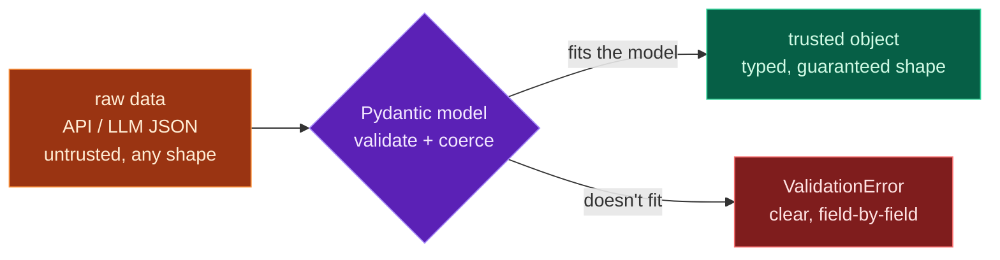

Yesterday's type hints document your code and let mypy check it *before* it runs — but they do nothing about the messy data that arrives *while* it runs. An API returns a field as a string when you expected a number; an LLM omits a key; a user sends `-5` for an age. Type hints won't catch any of that at runtime. **Pydantic** will.

Pydantic is one of the most important libraries in modern Python — and absolutely central to AI engineering. You define a **model** with typed fields (using the hints from Day 17), and Pydantic *enforces* them on real data: validating, **coercing** compatible types, filling defaults, and raising clear errors when data is wrong. It's how you safely turn raw API and LLM JSON into trusted Python objects. Today closes **Module 6** by making your types real at runtime.

> **A member lesson — and a big one for AI.** When you call an LLM and ask for structured output, Pydantic is how you turn its JSON into something you can trust. Install it and run every example. This is a library you'll use in nearly every AI project.

---

## The problem Pydantic solves

Recall the Day 12 caution: a dataclass declares types but **doesn't check them**. Watch it accept nonsense:

```python
from dataclasses import dataclass

@dataclass
class DC:
    age: int

print(DC(age="garbage"))    # accepted without complaint
```

**Output:**

```text
DC(age='garbage')
```

A dataclass (and a plain dict) trusts whatever you give it. That's fine for your *own* internal data — but data from the **outside world** (APIs, LLMs, user input, files) can't be trusted. You need something that *checks* it at the boundary. That's Pydantic.

---

## Your first Pydantic model

Install Pydantic (in your venv, Day 16), then subclass **`BaseModel`** and declare fields with type hints — exactly the Day 17 syntax:

```bash
pip install pydantic
```

```python
from pydantic import BaseModel

class Product(BaseModel):
    name: str
    price: float
    in_stock: bool = True       # a default, like a dataclass

p = Product(name="Mouse", price="25.5")    # note: price given as a STRING
print(p)
print("price type:", type(p.price).__name__)
print("as dict:", p.model_dump())
```

**Output:**

```text
name='Mouse' price=25.5 in_stock=True
price type: float
as dict: {'name': 'Mouse', 'price': 25.5, 'in_stock': True}
```

Two things just happened automatically. First, Pydantic **validated** the data against the model. Second — and notice this — you passed `price` as the *string* `"25.5"`, and Pydantic **coerced** it to the `float` `25.5`. That's exactly what you want for web data, where everything often arrives as strings. `model_dump()` converts a model back to a plain dict (for sending onward or saving).

---

## Validation errors that actually help

When data *doesn't* fit the model, Pydantic raises a **`ValidationError`** that pinpoints every problem. Missing a required field:

```python
from pydantic import BaseModel, ValidationError

class User(BaseModel):
    name: str
    age: int

try:
    User(name="Ada")     # no age!
except ValidationError as e:
    print(e)
```

**Output:**

```text
1 validation error for User
age
  Field required [type=missing, input_value={'name': 'Ada'}, input_type=dict]
    ...
```

Or a value it can't coerce — `"not a number"` simply isn't an int:

```text
1 validation error for User
age
  Input should be a valid integer, unable to parse string as an integer [type=int_parsing, ...]
```

Each error names the **field**, the **problem**, and the **input** that caused it. When an LLM returns slightly-wrong JSON, this is how you find out exactly what's off — instead of a mysterious crash three functions later.

---

## Parsing JSON straight into a model

Because API and LLM responses arrive as JSON, Pydantic gives you direct parsers. **`Model(**dict)`** validates a Python dict; **`Model.model_validate_json(text)`** parses *and* validates a JSON string in one step:

```python
from pydantic import BaseModel

class Point(BaseModel):
    x: int
    y: int

pt = Point.model_validate_json('{"x": 1, "y": 2}')
print(pt, "| x + y =", pt.x + pt.y)
```

**Output:**

```text
x=1 y=2 | x + y = 3
```

After parsing, `pt` is a real, validated object — `pt.x` and `pt.y` are guaranteed ints. This is the safe replacement for `json.loads` (Day 8) when the data needs to be *trusted*: instead of a raw dict you must defensively `.get()` from, you get a typed object you *know* has the right shape. (Access fields with `.x`, not `["x"]` — it's an object, not a dict.)

---

## The validation gate



**Reading this diagram:**

On the left, the **orange box** is raw data from the outside world — an API or LLM response. It's *untrusted*: it might have missing fields, wrong types, or extra junk. You can't safely use it as-is.

In the middle, the **purple diamond** is your Pydantic model acting as a **gate**. Every piece of incoming data must pass through it. The model tries to make the data fit: it checks each field's type, **coerces** what it sensibly can (a `"30"` into `30`), fills in defaults for what's missing-but-optional, and applies any constraints you set.

Two outcomes. If the data **fits**, you get the **green box** — a fully validated, typed object. From here on, your code can trust it completely: every field is present and the right type, so no defensive `.get()` calls, no surprise `None`s. If the data **doesn't fit**, you get the **red box** — a `ValidationError` that names exactly which field failed and why, raised right at the boundary instead of causing a confusing crash deep in your program.

The takeaway: **a Pydantic model is the gate between untrusted outside data and your trusted inside code.** Validate once at the boundary, and everything downstream is safe. For AI work — where you're constantly parsing API and LLM JSON — this gate is indispensable.

---

## Build it: validate a nested API response

Let's validate the kind of nested data from Day 8 — but now with real validation, coercion, defaults, nested models, and a constraint. Install Pydantic, then create **`validate.py`**:

```bash
python3 -m venv .venv && source .venv/bin/activate    # Windows: .venv\Scripts\Activate.ps1
pip install pydantic
```

```python
# validate.py — validate data with Pydantic (Day 18)
from pydantic import BaseModel, Field, ValidationError

class Address(BaseModel):
    city: str
    country: str = "Unknown"        # default if missing

class User(BaseModel):
    name: str
    age: int = Field(gt=0)          # must be greater than 0
    email: str
    address: Address                # a nested model

# 1) valid data — note age "30" (a string) gets coerced to int 30
raw = {
    "name": "Ada",
    "age": "30",
    "email": "ada@example.com",
    "address": {"city": "London"},
}
user = User(**raw)
print(user)
print(f"{user.name} is {user.age} (type {type(user.age).__name__}) in {user.address.city}, {user.address.country}")

# 2) invalid data → a clear ValidationError
bad = {"name": "Bob", "age": -5, "email": "bob@example.com", "address": {"city": "NYC"}}
try:
    User(**bad)
except ValidationError as e:
    print("\nValidation failed:")
    print(e)
```

**Run it** (`python validate.py`):

```text
name='Ada' age=30 email='ada@example.com' address=Address(city='London', country='Unknown')
Ada is 30 (type int) in London, Unknown

Validation failed:
1 validation error for User
age
  Input should be greater than 0 [type=greater_than, input_value=-5, input_type=int]
    For further information visit https://errors.pydantic.dev/2.13/v/greater_than
```

Look at everything that happened automatically on the valid data: `"30"` became the int `30`, the missing `country` filled in to `"Unknown"`, and the nested `address` dict became a real `Address` object. And the bad data was rejected with a precise, field-level error.

### Understanding the code

- **`class Address(BaseModel)`** and **`class User(BaseModel)`** — models inherit from `BaseModel`; that's what turns the type hints into runtime validation.
- **`address: Address`** is a **nested model** — Pydantic validates the inner dict into an `Address` object too, all the way down. (This is composition, Day 11, with validation.)
- **`country: str = "Unknown"`** — a default, used when the field is absent.
- **`age: int = Field(gt=0)`** — `Field(...)` adds **constraints**; `gt=0` means "greater than 0," so `-5` is rejected. (Others: `ge`, `lt`, `max_length`, etc.)
- **Coercion** turned the string `"30"` into an int — ideal for web/JSON data.
- **`ValidationError`** (Day 13's exception handling) lets you catch bad data and respond, instead of crashing.

This is the exact pattern you'll use to parse LLM and API responses into trusted objects throughout Modules 8 and 9.

---

## Common errors and how to fix them

**1. `ValidationError: Field required [type=missing]`**
The incoming data is missing a field your model requires. Either the data really is incomplete (handle the `ValidationError` and respond), or that field should be optional — give it a default (`country: str = "Unknown"`) or type it `field: str | None = None`.

**2. `ValidationError: Input should be a valid integer, unable to parse string as an integer`**
A value can't be coerced to the declared type — `"not a number"` isn't an int. Pydantic coerces *sensible* conversions (`"30"` → `30`) but rejects nonsense. Fix the source data, or widen the field's type if the variety is legitimate.

**3. `ValidationError: Input should be greater than 0 [type=greater_than]`**
A `Field(...)` constraint failed — the value broke a rule you set (here `gt=0`). That's the model working as designed; the data is genuinely invalid. Catch it and report, or correct the input.

**4. `TypeError: 'User' object is not subscriptable`**
You accessed a model like a dict — `user["name"]`. A Pydantic model is an *object*: use attribute access, `user.name`. (To get a dict, call `user.model_dump()`.)

**5. My fields aren't being validated at all**
Your class doesn't inherit from `BaseModel` — a plain class (or a dataclass) doesn't validate. Make it `class User(BaseModel):`. Only `BaseModel` subclasses get Pydantic's powers.

**6. `AttributeError: 'User' object has no attribute 'dict'` (or `parse_obj`)**
You're using Pydantic v1 method names on v2. In Pydantic 2.x it's **`model_dump()`** (not `.dict()`), **`model_validate()`** (not `.parse_obj()`), and **`model_validate_json()`** (not `.parse_raw()`). Use the `model_*` names.

> **Reading tip:** a `ValidationError` lists each bad field with its `type=` (e.g. `missing`, `int_parsing`, `greater_than`) and the offending `input_value`. Read those three and you know exactly what to fix in the data.

---

## Recap — Module 6 complete 🎉

You can now make types real at runtime:

- ✅ **`BaseModel`** — define models with typed fields that are *enforced*.
- ✅ **Coercion** — sensible conversions (`"30"` → `30`) done for you.
- ✅ **`ValidationError`** — precise, field-level errors on bad data.
- ✅ **Parsing** — `Model(**dict)` and `Model.model_validate_json(text)`; `model_dump()` back out.
- ✅ **Nested models, defaults, `Field(...)` constraints**.
- ✅ The mental model — a **validation gate** between untrusted data and trusted code.
- ✅ A **validated nested API response** turned into safe objects.

Module 6 gave you both halves of type safety: mypy checks your code ahead of time (Day 17), and Pydantic validates your data at runtime (Day 18).

### Day 18 cheat sheet

| Want to… | Write |
|---|---|
| Define a model | `class User(BaseModel):` |
| A field | `name: str` |
| Optional with default | `country: str = "Unknown"` |
| A constraint | `age: int = Field(gt=0)` |
| Nested model | `address: Address` |
| Validate a dict | `User(**data)` |
| Parse JSON text | `User.model_validate_json(text)` |
| Model → dict | `user.model_dump()` |
| Catch bad data | `except ValidationError as e:` |

---

## Coming up on Day 19 — a new module begins

Your code is now organised, type-checked, and validates its data. **Module 7 is Async Python** — and Day 19 introduces **async/await and concurrency**. When a program spends most of its time *waiting* (for an API, a download, an LLM to respond), `async` lets it do many of those waits *at once* instead of one after another. You'll learn coroutines, `await`, and `asyncio.gather`, and *measure* the speedup of running tasks concurrently. It's the key to fast LLM, RAG, and agent applications.

You've learned to validate data. Next, we learn to wait efficiently. See the full roadmap on the [Python for AI Engineering series page](/series/python-for-ai-engineering).

**See you on Day 19.** 🐍
