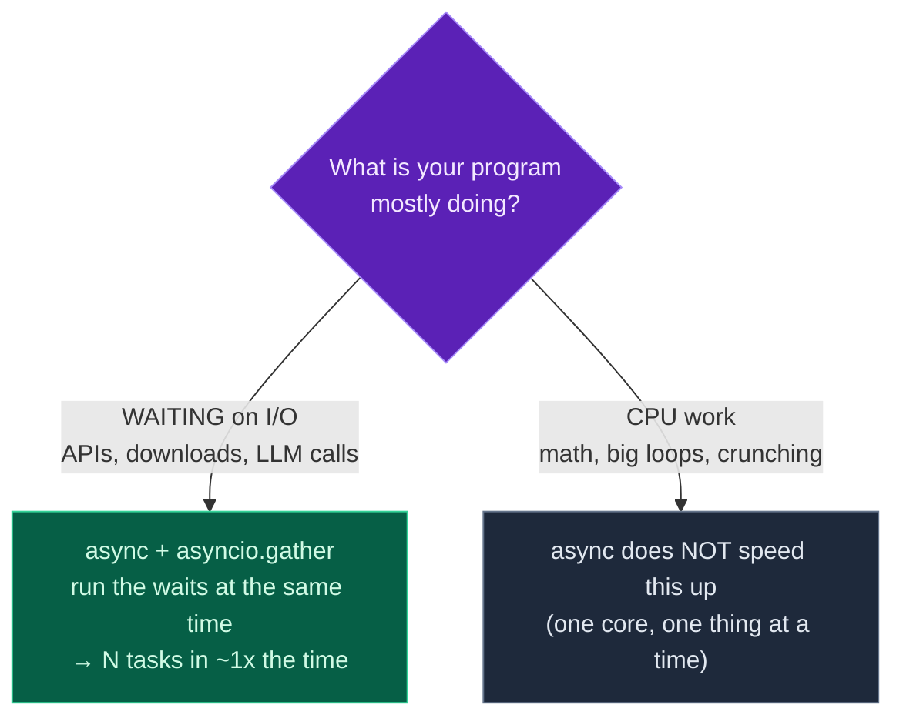

Welcome to **Module 7 — Async Python**. Here's a question that decides how fast a lot of AI code runs: when your program calls an API or an LLM, what is it actually *doing* while it waits for the response? With ordinary (synchronous) code, the answer is **nothing** — it sits there, frozen, until the reply comes back. Make ten LLM calls one after another and you wait for all ten in a row.

**Async** changes that. When code is mostly *waiting* on the outside world, `async`/`await` lets it start many waits **at once** and let them overlap — so ten calls take about as long as one. Today you'll learn coroutines, `await`, and `asyncio.gather`, and you'll *measure* the speedup yourself. This is the single biggest lever for fast LLM, RAG, and agent applications, which spend almost all their time waiting on model responses.

> **A member lesson.** Async is famously confusing at first — but the core idea is simple: *don't stand idle while you wait.* Run every example; seeing the timing drop from 3 seconds to 1 makes it click.

---

## The problem: waiting one thing at a time

Imagine fetching from three slow sources, each taking 1 second. Done synchronously, you start the first, wait a full second, start the second, wait another second, then the third — **3 seconds total**, almost all of it spent doing nothing but waiting. If those were three LLM calls, you'd wait for them strictly in turn.

The waiting is the waste. The CPU isn't busy — it's *idle*, blocked on the network. Async exists to fill that idle time: while waiting on the first response, start the second and third, so all three waits happen **together**.

---

## async/await: the basics

Two keywords and one runner:

- **`async def`** defines a **coroutine** — a function that can pause and resume.
- **`await`** pauses the coroutine until an *awaitable* (like another coroutine) finishes — and crucially, while paused, other coroutines can run.
- **`asyncio.run(...)`** starts the whole thing from normal synchronous code.

```python
import asyncio

async def hello():
    print("Hello")
    await asyncio.sleep(0.2)   # pause here without blocking everything
    print("World")

asyncio.run(hello())
```

**Output:**

```text
Hello
World
```

`asyncio.sleep` is our stand-in for "waiting on the network" — it pauses *this* coroutine but, unlike the ordinary `time.sleep`, it lets *other* coroutines use the wait. A coroutine can `await` another and use its return value, just like a normal function call:

```python
import asyncio

async def get_value():
    await asyncio.sleep(0.1)
    return 42

async def main():
    v = await get_value()
    print("got", v)

asyncio.run(main())
```

**Output:**

```text
got 42
```

### Coroutines must be awaited

A gotcha that catches everyone: **calling an `async` function doesn't run it** — it just creates a coroutine object. You have to `await` it (or hand it to `asyncio`):

```python
async def greet():
    return "hi"

result = greet()      # forgot await!
print("got:", result)
```

**Output:**

```text
got: <coroutine object greet at 0x...>
RuntimeWarning: coroutine 'greet' was never awaited
```

`greet()` didn't return `"hi"` — it returned an *unstarted coroutine*, and Python warns you it was "never awaited." The fix is `await greet()` (inside an `async def`). If your async code mysteriously does nothing, this is almost always why.

---

## Running things concurrently with `asyncio.gather`

Awaiting one coroutine at a time is still sequential. To run many **at once**, hand them all to **`asyncio.gather`**, which starts them together and waits for all to finish — returning their results in order:

```python
import asyncio

async def task(n):
    await asyncio.sleep(0.2)
    return n * 2

async def main():
    results = await asyncio.gather(task(1), task(2), task(3))
    print(results)

asyncio.run(main())
```

**Output:**

```text
[2, 4, 6]
```

All three `task`s ran concurrently — the whole thing took about `0.2` seconds, not `0.6`. `gather` is the workhorse of async Python: give it a list of coroutines (a comprehension is perfect: `gather(*[fetch(u) for u in urls])`) and it runs them all together. That's how you fire off many API or LLM calls in parallel.

---

## When does async actually help?

This is the crucial judgement — and the part the screenshot calls out as "where async matters":



**Reading this diagram:**

The purple diamond asks the one question that determines whether async will help: *what is your program mostly doing while it runs?*

If it's **waiting on I/O** (the green path) — calls to APIs, downloads, database queries, LLM responses — async is a huge win. These tasks spend their time *idle*, waiting for something external. With `asyncio.gather` you start all the waits at once and they overlap, so N tasks finish in roughly the time of **one**. This is the world of AI engineering: an agent making ten tool calls, a RAG system querying several sources, a batch of LLM requests — all waiting, all perfect for async.

If it's **CPU work** (the grey path) — heavy maths, big loops, crunching numbers — async does **not** help. There's no idle waiting to overlap; the work itself keeps one CPU core busy, and async still runs one thing at a time on that core. (For CPU-bound speedups you'd use multiprocessing, a different tool.)

There's also a trap hidden here: inside async code you must use *non-blocking* waits like `await asyncio.sleep(...)`. If you call the ordinary, **blocking** `time.sleep(...)`, it freezes the *entire* event loop — and your "concurrent" tasks quietly run one at a time again, with no speedup at all.

The takeaway: **async is for waiting, not for computing.** When your program's bottleneck is the network (and in AI, it almost always is), async turns a long line of waits into one short overlap.

---

## Build it: measure the speedup

Let's prove it. We'll fetch from three slow "sources" both ways — one after another, then all at once — and time each. No installs needed (`asyncio` is built in). Create **`concurrent_fetch.py`** in a `day-19` folder:

```python
# concurrent_fetch.py — async/await & concurrency (Day 19)
import asyncio
import time

async def fetch(source: str, delay: float) -> str:
    """Pretend to fetch from a slow source (delay = a network/LLM wait)."""
    print(f"  start  {source}")
    await asyncio.sleep(delay)        # 'await' = wait WITHOUT blocking others
    print(f"  done   {source}")
    return f"data from {source}"

async def run_sequential():
    results = []
    for src, delay in [("A", 1.0), ("B", 1.0), ("C", 1.0)]:
        results.append(await fetch(src, delay))   # one at a time
    return results

async def run_concurrent():
    tasks = [fetch(src, delay) for src, delay in [("A", 1.0), ("B", 1.0), ("C", 1.0)]]
    return await asyncio.gather(*tasks)           # all at once

async def main():
    print("Sequential (one after another):")
    t0 = time.perf_counter()
    await run_sequential()
    print(f"  took {time.perf_counter() - t0:.1f}s\n")

    print("Concurrent (all at once with gather):")
    t0 = time.perf_counter()
    results = await run_concurrent()
    print(f"  took {time.perf_counter() - t0:.1f}s")
    print(f"  results: {results}")

asyncio.run(main())
```

**Run it** (`python3 concurrent_fetch.py` / `python concurrent_fetch.py`):

```text
Sequential (one after another):
  start  A
  done   A
  start  B
  done   B
  start  C
  done   C
  took 3.0s

Concurrent (all at once with gather):
  start  A
  start  B
  start  C
  done   A
  done   B
  done   C
  took 1.0s
  results: ['data from A', 'data from B', 'data from C']
```

There it is. Sequential: each fetch finishes before the next starts — `3.0s`. Concurrent: look at the order — **all three start before any finishes**, the waits overlap, and the total drops to `1.0s`. Same work, a third of the time, just by not standing idle. With ten LLM calls instead of three, the win is 10x.

### Understanding the code

- **`async def fetch(...)`** is a coroutine; **`await asyncio.sleep(delay)`** simulates a network/LLM wait that *yields* to other coroutines.
- **`run_sequential`** `await`s each fetch in a loop — each must finish before the next begins, so the times add up (1 + 1 + 1 = 3s).
- **`run_concurrent`** builds a list of coroutines and hands them to **`asyncio.gather(*tasks)`** — they all start together and overlap, so the total is the *longest* one (~1s), not the sum.
- **`time.perf_counter()`** measures elapsed wall-clock time so you can see the difference.
- **`asyncio.run(main())`** is the single entry point that starts the async world from normal code.

The shape — *build a list of coroutines, `gather` them* — is exactly how you'll fan out real API and LLM calls tomorrow.

---

## Common errors and how to fix them

**1. `RuntimeWarning: coroutine '...' was never awaited`**
You called an `async` function without `await` — `greet()` instead of `await greet()`. Calling a coroutine just creates it; `await` runs it. (At the top level, use `asyncio.run(greet())`.)

**2. `SyntaxError: 'await' outside async function`**
You used `await` in a normal `def` (or at the top level of a script). `await` only works inside an `async def`. Make the enclosing function `async`, and start it with `asyncio.run(...)`.

**3. My "concurrent" code is just as slow as sequential**
You used the **blocking** `time.sleep(...)` (or another blocking call) inside async code, which freezes the whole event loop. Use the async equivalents — `await asyncio.sleep(...)`, and async libraries like `httpx` (tomorrow) for network calls. Blocking calls inside async silently kill concurrency.

**4. `RuntimeError: asyncio.run() cannot be called from a running event loop`**
You called `asyncio.run(...)` somewhere a loop is *already* running — most often inside a Jupyter notebook (which runs its own loop). In that case just `await` your coroutine directly instead of wrapping it in `asyncio.run`.

**5. I awaited my tasks in a loop and got no speedup**
`for t in tasks: await t` runs them one at a time — that's sequential. To run concurrently, collect the coroutines and `await asyncio.gather(*tasks)` (start them all, then wait).

**6. I used async for heavy computation and it didn't get faster**
Async only helps *I/O-bound* (waiting) work. CPU-bound work still runs on one core, one thing at a time — async can't parallelise the maths. That's a job for multiprocessing, not asyncio.

> **Reading tip:** "coroutine was never awaited" = you forgot `await`. "await outside async function" = you forgot `async def`. Those two messages cover most async beginner bugs.

---

## Recap — what you can do now

You can write programs that wait efficiently:

- ✅ **`async def`** coroutines and **`await`** to pause without blocking.
- ✅ **`asyncio.run(...)`** to launch async code from sync code.
- ✅ **Coroutines must be awaited** — calling alone does nothing.
- ✅ **`asyncio.gather`** to run many coroutines concurrently.
- ✅ **Measuring the win** — sequential (sum of waits) vs concurrent (the longest wait).
- ✅ **When async helps** — I/O-bound waiting, *not* CPU work; never block the loop.

### Day 19 cheat sheet

| Want to… | Write |
|---|---|
| Define a coroutine | `async def f():` |
| Pause for a wait | `await asyncio.sleep(s)` |
| Await a coroutine | `result = await f()` |
| Run from sync code | `asyncio.run(main())` |
| Run many at once | `await asyncio.gather(*coros)` |
| Build the list | `[fetch(u) for u in urls]` |
| Time it | `time.perf_counter()` |
| Don't (in async) | `time.sleep(...)` — it blocks everything |

---

## Coming up on Day 20

Today you ran fake waits with `asyncio.sleep`. Day 20 makes it real and ties it straight to AI: you'll see **async in practice for LLM, RAG, and agent applications** — fanning out many model-style calls concurrently, gathering their results, handling failures among them, and understanding exactly *why* async is the backbone of responsive AI systems (an agent that calls five tools, a RAG pipeline that queries several sources). It closes Module 7 and bridges into the API and LLM modules ahead.

You've learned the mechanics of async. Next, we point them at real AI workloads. See the full roadmap on the [Python for AI Engineering series page](/series/python-for-ai-engineering).

**See you on Day 20.** 🐍
