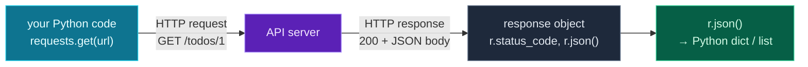

Welcome to **Module 8 — Python for APIs**. For the last two days you *simulated* network calls with `asyncio.sleep`. Now they get real. Almost everything interesting in modern software — and *all* of AI engineering — happens by calling **APIs**: your code sends a request over the internet to a service, and the service sends back data. LLMs, weather, payments, databases, search — all APIs.

Today you'll learn the essentials of **HTTP** (how the web actually talks) from a Python developer's point of view, then use the **`requests`** library to call real APIs: fetching data with GET, sending data with POST, passing parameters, parsing the JSON that comes back (Day 8's skills, now on live data), and handling the errors that real networks throw at you. You'll build a client against a live public API.

> **A member lesson.** This is the bridge to the outside world — and to LLMs in Module 9, which are "just" APIs with a very smart response. Run every call yourself; seeing real data come back over the wire is the fun part.

---

## How the web talks: HTTP in one minute

When your program calls an API, it sends an **HTTP request** to a URL and gets back an **HTTP response**. Two parts matter most:

- **The method** — what you want to do. **`GET`** fetches data ("give me this"); **`POST`** sends data ("create this"). (There are others — `PUT`, `DELETE` — but these two cover most of what you'll do.)
- **The status code** — a three-digit number telling you how it went:
  - **2xx = success** (`200 OK`, `201 Created`)
  - **4xx = you made a mistake** (`404 Not Found`, `401 Unauthorized`, `400 Bad Request`)
  - **5xx = the server had a problem** (`500 Internal Server Error`)

The data itself — both what you send and what you get back — is almost always **JSON** (Day 8). So calling an API is: send a request to a URL, check the status code, and parse the JSON response. That's the whole loop.

---

## The requests library

Python's `requests` is the friendly standard for HTTP. Install it (in your venv, Day 16):

```bash
pip install requests
```

A `GET` is one line. The call returns a **response object** with everything about the reply:

```python
import requests

r = requests.get("https://jsonplaceholder.typicode.com/users/1", timeout=10)
print("status_code:", r.status_code)
print("ok:", r.ok)
print("content-type:", r.headers["Content-Type"])

data = r.json()                      # parse the JSON body into a Python dict
print("name:", data["name"], "| city:", data["address"]["city"])
```

**Output:**

```text
status_code: 200
ok: True
content-type: application/json; charset=utf-8
name: Leanne Graham | city: Gwenborough
```

(We're using **jsonplaceholder.typicode.com** — a free fake API for practice, no key needed.) The response object gives you `.status_code` (the number), `.ok` (`True` for 2xx), `.headers` (response metadata), `.text` (the raw body), and — the one you'll use most — **`.json()`**, which parses the JSON body straight into a Python dict or list. From there it's all the dict/list navigation from Day 8. (Always pass **`timeout=`** so a hung server can't freeze your program forever.)

---

## Query parameters and POST

To filter or page a request, add **query parameters** with `params=` — requests builds the `?userId=1` part of the URL for you, safely:

```python
r = requests.get("https://jsonplaceholder.typicode.com/posts",
                 params={"userId": 1}, timeout=10)
posts = r.json()           # a list of dicts
print(len(posts), "posts")
```

To **send** data — creating something on the server — use `requests.post` with **`json=`**, which serialises your dict to a JSON request body:

```python
new = {"title": "Learn APIs", "body": "with requests", "userId": 1}
r = requests.post("https://jsonplaceholder.typicode.com/posts", json=new, timeout=10)
print(r.status_code, r.json())     # 201 Created, plus the new object
```

`params=` for the query string, `json=` for the request body — those two cover the vast majority of API calls you'll make (including, soon, to LLMs).

---

## Handling errors

Real network calls fail, and bad status codes don't raise an exception on their own — a `404` response is still a "successful" round trip as far as `requests` is concerned. You handle problems two ways:

- **Check the status yourself:** `if r.status_code == 404: ...` for cases you expect.
- **Let requests raise:** `r.raise_for_status()` turns any 4xx/5xx into an `HTTPError` you can catch:

```python
r = requests.get("https://jsonplaceholder.typicode.com/todos/99999", timeout=10)
try:
    r.raise_for_status()
except requests.exceptions.HTTPError as e:
    print("HTTPError:", e)
```

**Output:**

```text
HTTPError: 404 Client Error: Not Found for url: https://jsonplaceholder.typicode.com/todos/99999
```

And the network itself can fail before you even get a status — a bad host or no connection raises `requests.exceptions.ConnectionError`; a too-slow server raises `requests.exceptions.Timeout`. Wrap real calls in `try`/`except` (Day 13) and decide what to do — retry, fall back, or report.

---

## The request/response cycle



**Reading this diagram:**

Read it left to right — the round trip of a single API call.

The **cyan box** on the left is your code making the call: `requests.get(url)`. That produces an **HTTP request** (the top arrow) — it carries the *method* (`GET`) and the *path* (`/todos/1`) across the internet to the **purple box**, the API server.

The server does its work and sends back an **HTTP response** (the bottom arrow): a *status code* (`200`) plus a *body* (the JSON data). The `requests` library wraps all of that into the **grey box** — a **response object** — which holds the status (`r.status_code`), the headers, and the raw body, ready for you to inspect.

The final step is the **green box**: you call **`r.json()`** to parse the JSON body into a normal Python **dict or list** — and now you're back on familiar ground (Day 8), navigating the data with `[...]` and `.get()`.

The takeaway: **request out (method + URL), response back (status + JSON), then `.json()` into Python.** Every API call — including every LLM call you'll make next module — is this same cycle. Check the status, parse the body, use the data.

---

## Build it: a real API client

Let's call a live API for real — fetching, filtering, creating, and handling a missing resource. Install `requests`, then create **`api_client.py`** in a `day-21` folder:

```bash
python3 -m venv .venv && source .venv/bin/activate    # Windows: .venv\Scripts\Activate.ps1
pip install requests
```

```python
# api_client.py — calling a real API with requests (Day 21)
import requests

BASE = "https://jsonplaceholder.typicode.com"

# 1) GET a single resource
resp = requests.get(f"{BASE}/todos/1", timeout=10)
print("Status:", resp.status_code)
todo = resp.json()
print(f"Todo: {todo['title']!r} (done={todo['completed']})")

# 2) GET a list with query parameters
resp = requests.get(f"{BASE}/posts", params={"userId": 1}, timeout=10)
posts = resp.json()
print(f"\nUser 1 has {len(posts)} posts. First two titles:")
for post in posts[:2]:
    print(f"  - {post['title'][:45]}")

# 3) POST to create a resource
new = {"title": "Learn APIs", "body": "with requests", "userId": 1}
resp = requests.post(f"{BASE}/posts", json=new, timeout=10)
print(f"\nCreated post -> status {resp.status_code}, new id {resp.json()['id']}")

# 4) handle a missing resource (404) gracefully
resp = requests.get(f"{BASE}/todos/99999", timeout=10)
if resp.status_code == 404:
    print("\nTodo 99999 not found (404) - handled gracefully.")
else:
    resp.raise_for_status()
```

**Run it** (`python api_client.py`):

```text
Status: 200
Todo: 'delectus aut autem' (done=False)

User 1 has 10 posts. First two titles:
  - sunt aut facere repellat provident occaecati 
  - qui est esse

Created post -> status 201, new id 101

Todo 99999 not found (404) - handled gracefully.
```

That's real data fetched over the internet, a real resource "created" (the fake API returns `201` and a new `id` of `101`), and a missing-resource case handled cleanly — the full shape of working with any API.

### Understanding the code

- **`requests.get(f"{BASE}/todos/1")`** fetches one resource; `resp.json()` turns it into a dict you read with `todo['title']`.
- **`params={"userId": 1}`** adds the query string `?userId=1` so the server returns only user 1's posts — and `resp.json()` here is a *list*, so you loop it (Day 8 navigation on live data).
- **`requests.post(..., json=new)`** sends your dict as a JSON body to create a resource; the response includes the server's version (with its new `id`).
- **`resp.status_code == 404`** handles the expected "not found" case gracefully; **`resp.raise_for_status()`** would turn any *other* bad status into an exception to catch.
- **`timeout=10`** on every call ensures a slow server can't hang your program.

Swap the URL for a real service's endpoint and add an API key (tomorrow), and this is exactly how you'll call any API — including an LLM.

---

## Common errors and how to fix them

**1. `ModuleNotFoundError: No module named 'requests'`**
`requests` isn't installed in your active environment. Activate your venv and `pip install requests` (and add it to `requirements.txt`, Day 16).

**2. `requests.exceptions.ConnectionError`**
Your code couldn't reach the server — no internet, a typo in the URL, or a wrong host. Check the URL and your connection; wrap the call in `try`/`except requests.exceptions.ConnectionError` to handle it gracefully.

**3. `requests.exceptions.HTTPError: 404 Client Error: ...`**
You called `raise_for_status()` and the server returned a 4xx/5xx. The response was technically received, but the request was wrong (bad path, missing auth, bad data). Read the status code: `404` = wrong URL/resource, `401`/`403` = auth (tomorrow), `400` = bad request body.

**4. `json.decoder.JSONDecodeError` when calling `.json()`**
The response body wasn't JSON — often an HTML error page from a 5xx, or an empty body. Check `resp.status_code` and `resp.headers["Content-Type"]` *before* calling `.json()`, or look at `resp.text` to see what actually came back.

**5. My program hangs forever on a request**
You didn't set a `timeout`. Without it, a slow or unresponsive server blocks your code indefinitely. Always pass `timeout=10` (or similar) and catch `requests.exceptions.Timeout`.

**6. A `404`/error response slipped through as if it were data**
A bad status code does **not** raise by itself — `requests` happily returns the error response. Either check `resp.status_code` / `resp.ok`, or call `resp.raise_for_status()` to force an exception on failures, before you trust `resp.json()`.

> **Reading tip:** with APIs, the status code is your first diagnostic. `2xx` → parse the body; `4xx` → *your* request is wrong (URL, auth, data); `5xx` → the *server* is having trouble (retry later). Read the code before the body.

---

## Recap — what you can do now

You can talk to real services over the internet:

- ✅ **HTTP basics** — methods (`GET`/`POST`), status codes (2xx/4xx/5xx), JSON bodies.
- ✅ **`requests`** — `get`/`post`, and the response object (`.status_code`, `.ok`, `.json()`, `.headers`).
- ✅ **Query params** (`params=`) and **JSON bodies** (`json=`).
- ✅ **Error handling** — `raise_for_status()`, `timeout=`, and `requests.exceptions`.
- ✅ Parsing live JSON into Python (Day 8, now on real data).
- ✅ A **working client** against a live public API.

### Day 21 cheat sheet

| Want to… | Write |
|---|---|
| Install it | `pip install requests` |
| Fetch data | `requests.get(url, timeout=10)` |
| Add query params | `requests.get(url, params={...})` |
| Send data | `requests.post(url, json={...})` |
| Parse the body | `resp.json()` |
| Check success | `resp.status_code` / `resp.ok` |
| Raise on failure | `resp.raise_for_status()` |
| Catch network errors | `except requests.exceptions.RequestException:` |

---

## Coming up on Day 22

`requests` is great, but it's **synchronous** — one call at a time, exactly the slow pattern async fixes (Days 19–20). Tomorrow you'll meet **`httpx`**, a modern HTTP library that works just like `requests` but supports **`async`** — so you can fire off many API calls concurrently with `asyncio.gather`. You'll also learn to handle **API keys securely**, loading them from a `.env` file (Day 15) and sending them in headers — the exact setup you need before calling paid APIs and LLMs.

You've learned to call one API. Next, we call many — fast and securely. See the full roadmap on the [Python for AI Engineering series page](/series/python-for-ai-engineering).

**See you on Day 22.** 🐍
