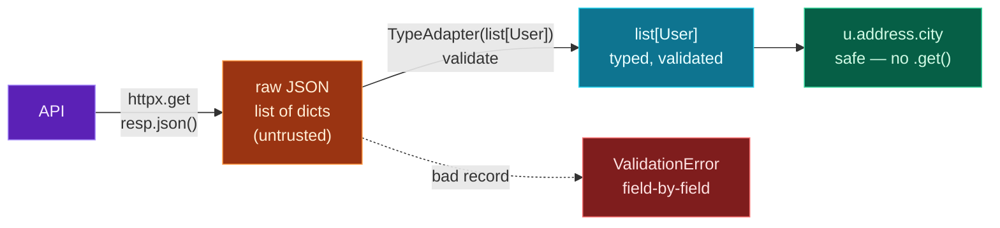

You can now call any API and get JSON back (Days 21–22). But `resp.json()` hands you a raw dict — *untrusted* data from a service you don't control. A field might be missing, a number might arrive as a string, the shape might have changed since you wrote the code. Navigate it carelessly and you get a `KeyError` or a `TypeError` somewhere far from the cause (Day 8's pain).

Today closes **Module 8** by combining everything into the professional way to consume an API: **validate the response with Pydantic** (Day 18) the moment it arrives. You define models matching the API's shape, validate the JSON against them, and from that point on you're working with **typed, trusted objects** — no defensive `.get()` chains, no surprise crashes. You'll fetch real users from a live API and turn them into validated models, and watch a malformed record get rejected with a precise error.

> **A member lesson — Module 8 finale.** This is the exact pattern you'll use on LLM responses next module: get JSON, validate it into a model, trust it. Run the project and see real API data become typed objects.

---

## The problem with raw `.json()`

When you call `resp.json()`, you get a plain dict (or list of dicts). To use it you reach in with `["key"]` and hope every key exists and every type is what you assumed. With external data that's a gamble: APIs evolve, optional fields come and go, and a value you expected to be a number sometimes arrives as a string. You end up writing defensive `.get("a", {}).get("b")` chains everywhere — and *still* miss cases.

Pydantic flips this around. Validate the response **once**, at the boundary, into a model. If the data fits, everything downstream is guaranteed correct. If it doesn't, you find out *immediately*, with a message naming the exact field — not three functions later.

---

## Validating a single response

Define a model for the resource, then pass the parsed JSON to **`model_validate`**:

```python
import httpx
from pydantic import BaseModel

class Todo(BaseModel):
    id: int
    title: str
    completed: bool

data = httpx.get("https://jsonplaceholder.typicode.com/todos/1", timeout=10).json()
todo = Todo.model_validate(data)
print(todo)
```

**Output:**

```text
id=1 title='delectus aut autem' completed=False
```

`todo` is now a validated `Todo` object — `todo.completed` is *guaranteed* a bool, `todo.id` *guaranteed* an int. You access fields with `.` (Day 18), and your editor and mypy understand them.

---

## Validating a whole list

API endpoints often return a *list* of items. Validating each one individually works, but Pydantic's **`TypeAdapter`** validates the entire list in one call — `TypeAdapter(list[User])`:

```python
from pydantic import TypeAdapter

raw_users = httpx.get(".../users").json()          # a list of dicts
users = TypeAdapter(list[User]).validate_python(raw_users)   # → list[User]
```

`TypeAdapter(list[User]).validate_python(raw)` checks every item against `User` and gives you a clean `list[User]`. One bad item makes the whole call raise (with the index of the offender) — exactly what you want when the list should be uniform. This is the everyday move for paginated or collection endpoints.

---

## Coercion and extra fields: built for real APIs

Two Pydantic behaviours make it ideal for messy real-world responses.

**Coercion** (Day 18) quietly fixes the common "everything's a string" problem — and real APIs really do this. In the project below, the live API returns latitude and longitude as *strings* (`"-37.3159"`), and a `float` field accepts them, converting to real numbers automatically.

**Extra fields are ignored by default** — so your model only needs the fields you *care about*, and the API can add new ones without breaking you:

```python
from pydantic import BaseModel

class Small(BaseModel):
    id: int                                # we only want id

m = Small.model_validate({"id": 1, "title": "x", "userId": 9})
print(m, "→ extra fields dropped, no error")
```

**Output:**

```text
id=1 → extra fields dropped, no error

```

This tolerance is a feature: declare just what you use, and stay resilient to API changes. (If you'd rather *reject* unexpected fields — useful for catching typos or schema drift — set `model_config = ConfigDict(extra="forbid")`, and extra keys raise an error.)

---

## Handling malformed records

When validation fails, the **`ValidationError`** carries structured details: `e.error_count()` and `e.errors()` (a list of dicts with the field location and message). That lets you report or skip bad data precisely instead of crashing:

```python
from pydantic import BaseModel, ValidationError

class User(BaseModel):
    id: int

try:
    User.model_validate({"id": "oops"})
except ValidationError as e:
    for err in e.errors():
        loc = ".".join(str(p) for p in err["loc"])
        print(f"{loc}: {err['msg']}")
```

In a batch, wrap each item's validation in `try`/`except ValidationError` (Day 13): keep the good records, log the bad ones, and the one broken item never sinks the whole job — the same robustness mindset as the async batch on Day 20.

---

## The validated pipeline



**Reading this diagram:**

Read left to right — it's Day 21's request/response cycle with a validation step bolted on, and that step changes everything.

The **purple API box** sends back data, which `httpx` and `.json()` turn into the **orange box**: raw JSON, a list of dicts. It's *untrusted* — the same shapeless data you'd otherwise navigate defensively.

The key arrow is the next one: **`TypeAdapter(list[User]).validate_python(...)`** feeds that raw data through your Pydantic models. Two things can happen. If the data fits, you reach the **cyan box** — a `list[User]` of fully **typed, validated** objects. From here, the **green box** shows the payoff: `u.address.city` is *safe*, guaranteed to exist and be the right type — no `.get()`, no `KeyError`, no defensive checks. If a record *doesn't* fit, the dotted arrow leads to the **red box**: a `ValidationError` that names the exact field that's wrong.

The takeaway: **validation is the boundary between the untrusted outside (orange) and your trusted inside (cyan/green).** Cross it once, at the moment data arrives, and everything after it is clean, typed, and safe. This is how professionals consume APIs — and how you'll consume LLM output.

---

## Build it: fetch and validate real users

Let's consume a live API the right way — fetch a list of users with nested addresses, validate the whole thing into typed models, then reject a deliberately-broken record. Set up the venv, then create **`fetch_validate.py`** in a `day-23` folder:

```bash
python3 -m venv .venv && source .venv/bin/activate    # Windows: .venv\Scripts\Activate.ps1
pip install httpx pydantic
```

```python
# fetch_validate.py — parse & validate API responses with Pydantic (Day 23)
import httpx
from pydantic import BaseModel, TypeAdapter, ValidationError

BASE = "https://jsonplaceholder.typicode.com"

class Geo(BaseModel):
    lat: float
    lng: float

class Address(BaseModel):
    city: str
    zipcode: str
    geo: Geo

class User(BaseModel):
    id: int
    name: str
    username: str
    email: str
    address: Address

# 1) fetch the raw JSON
resp = httpx.get(f"{BASE}/users", timeout=10)
resp.raise_for_status()
raw_users = resp.json()           # a list of dicts (untrusted)
print(f"Fetched {len(raw_users)} raw user records.")

# 2) validate the whole list into typed User objects at once
users = TypeAdapter(list[User]).validate_python(raw_users)
print(f"Validated {len(users)} users.\n")

# 3) now everything is typed and trusted — no defensive .get() needed
for u in users[:3]:
    print(f"  {u.name} (@{u.username}) in {u.address.city} [{u.address.geo.lat}, {u.address.geo.lng}]")

# 4) a bad record is rejected with clear, field-level errors
bad = {"id": "oops", "name": "Broken", "username": "x", "email": "x@x.com",
       "address": {"city": "Nowhere", "zipcode": "0", "geo": {"lat": "not-a-number", "lng": 0.0}}}
try:
    User.model_validate(bad)
except ValidationError as e:
    print(f"\nRejected a bad record ({e.error_count()} errors):")
    for err in e.errors():
        loc = ".".join(str(p) for p in err["loc"])
        print(f"  - {loc}: {err['msg']}")
```

**Run it** (`python fetch_validate.py`):

```text
Fetched 10 raw user records.
Validated 10 users.

  Leanne Graham (@Bret) in Gwenborough [-37.3159, 81.1496]
  Ervin Howell (@Antonette) in Wisokyburgh [-43.9509, -34.4618]
  Clementine Bauch (@Samantha) in McKenziehaven [-68.6102, -47.0653]

Rejected a bad record (2 errors):
  - id: Input should be a valid integer, unable to parse string as an integer
  - address.geo.lat: Input should be a valid number, unable to parse string as a number
```

Look closely at the good output: those latitudes and longitudes came from the API as **strings**, and Pydantic coerced them to floats automatically (notice `u.address.geo.lat` prints as a number). And the bad record was rejected with **two** precise errors — including the nested path `address.geo.lat`, which tells you exactly where deep inside the structure the problem is.

### Understanding the code

- **`Geo`, `Address`, `User`** mirror the API's nested shape — models inside models (Day 11 composition + Day 18 validation).
- **`TypeAdapter(list[User]).validate_python(raw_users)`** validates the *entire list* in one call, returning a `list[User]`.
- **`u.address.geo.lat`** — fully typed, safe access several layers deep, with zero defensive code. Compare to Day 8's careful `.get()` chains on raw dicts: validation earned that simplicity.
- **Coercion** turned the API's string coordinates into real `float`s without a line of conversion code.
- **`ValidationError` with `e.errors()`** gives structured, field-level errors (note the nested `address.geo.lat` location) so you can report or skip bad data precisely.

This `fetch → validate → typed objects` flow is the template for the LLM calls in Module 9 — only the URL and the model shape change.

---

## Common errors and how to fix them

**1. `ValidationError: ... Input should be a valid integer ...`**
The API returned a field whose type doesn't match (and can't be coerced into) your model. Either the data is genuinely bad (catch the error and handle it), or your model is wrong — check the API's real response (`print(resp.json())`) and align your field types to it.

**2. A nested error like `address.geo.lat: ...`**
Pydantic shows the *full path* to the bad field inside nested models. Read it as a route: `address` → `geo` → `lat`. The problem is that deep field — fix the data there, or that model's type.

**3. My model rejected a valid response because of an extra field**
You set `extra="forbid"` and the API sent a field you didn't declare. Either remove `forbid` (the default *ignores* extras — usually what you want for APIs), or add the field to your model.

**4. `Input should be a valid dictionary or instance of User`**
You passed a *list* to a single model's `model_validate`. For a list, use `TypeAdapter(list[User]).validate_python(data)`; `Model.model_validate` is for one item.

**5. One bad record crashed my whole batch**
You validated a list with `TypeAdapter(list[Model])`, which raises on the first bad item. If you want to keep the good ones, validate each item in a loop with `try`/`except ValidationError`, collecting successes and logging failures.

**6. `model_validate` worked but the values look wrong / truncated**
Often coercion doing something you didn't expect (e.g. a float silently becoming an int with a stricter type, or a string `"1"` becoming `1`). Check your field types match the data's real meaning, and use `Field(...)` constraints (Day 18) to enforce ranges where it matters.

> **Reading tip:** a `ValidationError` from an API response is usually *informative, not catastrophic* — it's telling you the data's real shape differs from your model. Print `resp.json()` for one record, compare it to your model, and adjust whichever is wrong.

---

## Recap — Module 8 complete 🎉

You can consume any API like a professional:

- ✅ **Validate responses** — `Model.model_validate(resp.json())` turns raw JSON into typed objects.
- ✅ **Validate lists** — `TypeAdapter(list[Model]).validate_python(...)`.
- ✅ **Coercion** — string numbers from APIs become real numbers automatically.
- ✅ **Extra fields ignored** by default (resilient to API changes); `extra="forbid"` to be strict.
- ✅ **Structured errors** — `e.errors()` with nested field paths for precise handling.
- ✅ A **fetch-and-validate pipeline** over live API data.

Module 8 took you from "how the web talks" to calling APIs concurrently and securely, and finally to consuming their responses safely. You're ready for the real thing.

### Day 23 cheat sheet

| Want to… | Write |
|---|---|
| Validate one response | `Model.model_validate(resp.json())` |
| Validate a list | `TypeAdapter(list[Model]).validate_python(data)` |
| Access safely | `obj.address.city` (typed, no `.get()`) |
| Reject unknown fields | `model_config = ConfigDict(extra="forbid")` |
| Inspect failures | `e.errors()`, `e.error_count()` |
| Survive a bad item | per-item `try/except ValidationError` |
| Nested error path | read `loc` like `address.geo.lat` |

---

## Coming up on Day 24 — a new module begins

Everything so far has been building to this. **Module 9 is Python for AI Workflows**, and Day 24 is the one you've been waiting for: **calling an LLM API**. You'll make real calls to a large language model — and we'll look at **Claude, OpenAI, and Gemini side by side** so you can see how their request/response shapes compare. You'll use *exactly* the skills from this module — a key from `.env`, an HTTP call, and Pydantic to parse the response — plus a no-API-key mock so you can follow along even without an account. This is where you start building actual AI applications.

You've learned to consume APIs safely. Next, we call the smartest API of all. See the full roadmap on the [Python for AI Engineering series page](/series/python-for-ai-engineering).

**See you on Day 24.** 🐍
