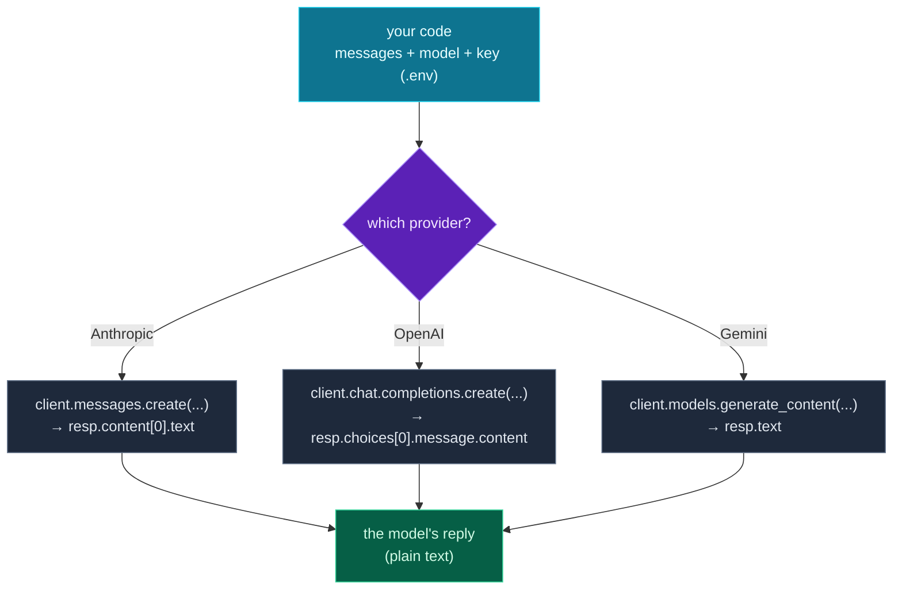

This is the day everything has been building toward. **Module 9 — Python for AI Workflows** starts here, and today you make a real call to a **large language model**. The wonderful secret you're about to confirm: *an LLM call is just an API call.* Everything from Module 8 applies unchanged — a key from `.env` (Day 22), an HTTP request to a provider, and parsing the JSON reply (Day 23). The only new part is that the "reply" happens to be written by a very capable model.

You'll see **Claude, OpenAI, and Gemini side by side** — because they share almost the same shape, and seeing all three makes the pattern obvious rather than provider-specific. And because LLM calls need an API key (and cost money), you'll build with a **no-key mock** first, so you can run the whole structure today even without an account, then swap in a real provider whenever you're ready.

> **A member lesson — the payoff of the whole series.** You now have every prerequisite: functions, dicts, type hints, async, HTTP, secure keys, validation. An LLM call uses all of them. Run the mock today; add a real key when you have one.

---

## An LLM call is just an API call

Strip away the magic and a chat-model request is three things you already know:

- **Messages** — a list of `{"role": ..., "content": ...}` dicts (exactly the `ChatMessage` shape from Day 12). The roles are `system` (instructions), `user` (you), and `assistant` (the model).
- **A model name** — which model to use (e.g. `claude-opus-4-8`).
- **A key** — your credential, loaded from `.env` (Day 22), never hard-coded.

You send those, and the provider returns a response object. You reach into it to pull out the generated **text** — the same "navigate the response" skill from Day 8 and Day 23. That's the entire loop: *messages + model in, text out.*

---

## Start with a mock (no key needed)

Because real calls need a key and cost tokens, it's smart to develop against a **mock** — a fake function with the same shape that returns instantly and free. It lets you build and test all the surrounding code (prompt construction, response handling, your CLI) without spending anything, then swap in a real provider at the end:

```python
def ask_mock(prompt: str) -> str:
    """A fake LLM so you can run the whole structure with NO API key."""
    return f"(mock reply) A short, helpful answer to: {prompt!r}"
```

This is a genuinely professional habit — mock the expensive external call while you build everything around it. Today's project uses the real Claude call *if* a key is set, and falls back to this mock if not, so it runs either way.

---

## Calling Claude (Anthropic)

Here's a real call to Claude. Install the SDK and put your key in `.env`:

```bash
pip install anthropic
```

> File: `.env`
> ```
> ANTHROPIC_API_KEY=sk-ant-...your key...
> ```

```python
from anthropic import Anthropic

client = Anthropic()                       # reads ANTHROPIC_API_KEY from the environment
resp = client.messages.create(
    model="claude-opus-4-8",
    max_tokens=1024,
    messages=[{"role": "user", "content": "Explain recursion in one sentence."}],
)
print(resp.content[0].text)                # Claude's reply text
```

It maps one-to-one onto what you know: `Anthropic()` creates a client (it reads the key from the environment, just like the headers pattern on Day 22), `messages.create(...)` sends your messages and model (Day 12's structure), and `resp.content[0].text` navigates the response to the generated text (Day 8). `max_tokens` caps how long the reply can be. That's a real AI call in five lines.

---

## The same shape across providers

The reason to look at all three: they're nearly identical. Each one — create a client (key from the environment), send a model + a prompt, read the text out — differs only in the **method name** and the **response path**:

**Claude (Anthropic)** — `pip install anthropic`:

```python
from anthropic import Anthropic

client = Anthropic()
resp = client.messages.create(
    model="claude-opus-4-8",
    max_tokens=1024,
    messages=[{"role": "user", "content": prompt}],
)
text = resp.content[0].text
```

**OpenAI** — `pip install openai`:

```python
from openai import OpenAI

client = OpenAI()
resp = client.chat.completions.create(
    model="gpt-4o",                        # use a current OpenAI model
    messages=[{"role": "user", "content": prompt}],
)
text = resp.choices[0].message.content
```

**Gemini (Google)** — `pip install google-genai`:

```python
from google import genai

client = genai.Client()
resp = client.models.generate_content(
    model="gemini-2.0-flash",              # use a current Gemini model
    contents=prompt,
)
text = resp.text
```

Look at how little differs. All three take a model and your prompt; all three return an object you read the text from. The variations are small and mechanical:

| | Client | Call | Read the text |
|---|---|---|---|
| **Claude** | `Anthropic()` | `messages.create(messages=[...])` | `resp.content[0].text` |
| **OpenAI** | `OpenAI()` | `chat.completions.create(messages=[...])` | `resp.choices[0].message.content` |
| **Gemini** | `genai.Client()` | `models.generate_content(contents=...)` | `resp.text` |

(Each needs its own SDK and its own API key in `.env`, and model names change over time — check the provider's docs for the current one. The *shape*, though, is what matters, and it's the same.) Learn one and you can read all three; this is why "calling an LLM" is a transferable skill, not a per-provider chore.

---

## The call, across three providers



**Reading this diagram:**

Start at the **cyan box** — your code, holding the three inputs every LLM call needs: the **messages** (your prompt as role/content dicts), the **model** name, and the **key** loaded from `.env`. These are the same three ingredients regardless of who you call.

The **purple diamond** is the only real choice: *which provider?* Each branch leads to a **grey box** showing that provider's call and the path to its text — `client.messages.create(...)` → `resp.content[0].text` for Anthropic, `chat.completions.create(...)` → `resp.choices[0].message.content` for OpenAI, `models.generate_content(...)` → `resp.text` for Gemini. Notice the boxes are almost the same: a create-style method that takes your prompt, and a short path into the response object.

Every branch converges on the **green box** — the model's reply, as plain text. From there it's ordinary Python again: print it, parse it, validate it (tomorrow), or feed it onward.

The takeaway: **the inputs are identical and the output is identical — only the middle (one method name, one response path) changes per provider.** That's why an LLM call isn't a new skill, it's the Module 8 API call with a smarter response. Build against the shape, not the vendor.

---

## Build it: an LLM client with a mock fallback

Let's build a script that calls Claude when a key is available and falls back to the mock when it isn't — so it runs for everyone today. Set up the venv (install `python-dotenv`; add `anthropic` only if you'll use a real key), then create **`ask_llm.py`** in a `day-24` folder:

```bash
python3 -m venv .venv && source .venv/bin/activate    # Windows: .venv\Scripts\Activate.ps1
pip install python-dotenv
# optional, only if you have a key:  pip install anthropic
```

```python
# ask_llm.py — call an LLM, with a no-key mock fallback (Day 24)
import os
from dotenv import load_dotenv

load_dotenv()

def ask_mock(prompt: str) -> str:
    """A fake LLM so you can run the whole structure with NO API key."""
    return f"(mock reply) A short, helpful answer to: {prompt!r}"

def ask_claude(prompt: str) -> str:
    """Real Anthropic Claude call. Needs: pip install anthropic + ANTHROPIC_API_KEY."""
    from anthropic import Anthropic
    client = Anthropic()                       # reads ANTHROPIC_API_KEY from the env
    resp = client.messages.create(
        model="claude-opus-4-8",
        max_tokens=1024,
        messages=[{"role": "user", "content": prompt}],
    )
    return resp.content[0].text                # Claude's reply text

# --- run: use Claude if a key is set, otherwise the mock ---
prompt = "Explain recursion in one sentence."
if os.getenv("ANTHROPIC_API_KEY"):
    print("Using Claude:")
    print(ask_claude(prompt))
else:
    print("No ANTHROPIC_API_KEY found - using the mock:\n")
    print(ask_mock(prompt))
```

**Run it** (`python ask_llm.py`). With no key set, you get the mock — and it runs instantly, free:

```text
No ANTHROPIC_API_KEY found - using the mock:

(mock reply) A short, helpful answer to: 'Explain recursion in one sentence.'
```

Add a real key to `.env` (and `pip install anthropic`), run again, and `ask_claude` fires instead — a real model answers. The surrounding code never changes; only the function that does the call.

### Understanding the code

- **`load_dotenv()` + `os.getenv("ANTHROPIC_API_KEY")`** load and check for the key (Day 22) — the key lives in `.env`, never in the code.
- **`ask_mock`** is the free, instant stand-in — same signature (`str -> str`) as the real function, so they're interchangeable.
- **`ask_claude`** is the real call: a client (key from the env), `messages.create(...)` with the model and your prompt, and `resp.content[0].text` to read the reply.
- **The `if os.getenv(...)`** picks the real provider when a key is present and the mock otherwise — so the script always runs, and you can develop the whole flow before spending a cent.
- **Type hints** (`prompt: str -> str`, Day 17) document each function's contract.

This mock-or-real pattern is exactly how you'll build and test AI features cheaply — and `ask_claude` is the seed of the CLI tool you'll finish on Day 27.

---

## Common errors and how to fix them

**1. `AuthenticationError` / `401` (invalid or missing key)**
The provider rejected your credentials. Check that `.env` has the right variable name (`ANTHROPIC_API_KEY`, `OPENAI_API_KEY`, `GEMINI_API_KEY` — they differ), that `load_dotenv()` ran *before* you create the client, and that the key is valid and not expired. Print `bool(os.getenv("ANTHROPIC_API_KEY"))` — the boolean, never the key itself — to confirm it loaded.

**2. `ModuleNotFoundError: No module named 'anthropic'` (or 'openai' / 'google')**
The provider's SDK isn't installed in your active venv. Install it (`pip install anthropic` / `openai` / `google-genai`), and note the import names differ: `from anthropic import Anthropic`, `from openai import OpenAI`, `from google import genai`.

**3. I read the response wrong and got an `AttributeError` / `IndexError`**
Each provider's response path is different — `resp.content[0].text` (Claude), `resp.choices[0].message.content` (OpenAI), `resp.text` (Gemini). Using one provider's path on another's response fails. Match the path to the provider (see the table above); when unsure, `print(resp)` to see the object's shape.

**4. `RateLimitError` / `429`, or a surprising bill**
You sent requests too fast, or more than your plan allows — and real calls cost money per token. While learning, use the **mock**; for real calls, add retries/backoff, keep `max_tokens` modest, and don't loop over a model call without thinking about cost. (This is exactly why we mock first.)

**5. `404` / "model not found"**
The model name is wrong or retired — names change over time. Use a current model ID from the provider's documentation (e.g. `claude-opus-4-8` for Claude), and watch for typos.

**6. My API key leaked / is in my code or on GitHub**
You hard-coded it or committed `.env`. Move the key to `.env`, add `.env` to `.gitignore` (Day 15), and **rotate the key** (revoke and regenerate) — an exposed LLM key can run up real charges. Never put a key in a `.py` file.

> **Reading tip:** LLM-call errors are ordinary API errors (Module 8). `401` → key/auth; `404` → model name; `429` → rate/cost; an `AttributeError` reading the reply → wrong response path for that provider. Diagnose them exactly as you would any API.

---

## Recap — what you can do now

You can make real AI calls:

- ✅ **An LLM call is an API call** — messages + model + key in, text out.
- ✅ **Calling Claude** — `Anthropic()`, `messages.create(...)`, `resp.content[0].text`.
- ✅ **Claude vs OpenAI vs Gemini** — the same shape; only the method and response path differ.
- ✅ **The mock pattern** — build and test free, swap in a real provider when ready.
- ✅ **Keys from `.env`** — never hard-coded (Module 8 carried straight in).
- ✅ An **LLM client** that runs with or without a key.

### Day 24 cheat sheet

| Provider | Install | Call | Read text |
|---|---|---|---|
| **Claude** | `pip install anthropic` | `client.messages.create(model=, max_tokens=, messages=[...])` | `resp.content[0].text` |
| **OpenAI** | `pip install openai` | `client.chat.completions.create(model=, messages=[...])` | `resp.choices[0].message.content` |
| **Gemini** | `pip install google-genai` | `client.models.generate_content(model=, contents=...)` | `resp.text` |
| **Mock** | — | `ask_mock(prompt)` | the returned string |

*(Keys: `ANTHROPIC_API_KEY` / `OPENAI_API_KEY` / `GEMINI_API_KEY` in `.env`. Each `client` reads its key from the environment.)*

---

## Coming up on Day 25

You sent one bare `user` message today. Real AI features need more structure: a **`system`** message that sets the model's role and rules, multi-turn message lists, and reusable prompt *templates* you fill with data. Tomorrow is **structuring prompts and responses** — building messages cleanly (with the `ChatMessage`/`Conversation` dataclasses from Day 12), writing a reusable prompt builder, and handling the response in a structured way. It's how you go from a one-off call to a dependable AI component.

You've made your first LLM call. Next, we make it structured and reusable. See the full roadmap on the [Python for AI Engineering series page](/series/python-for-ai-engineering).

**See you on Day 25.** 🐍
