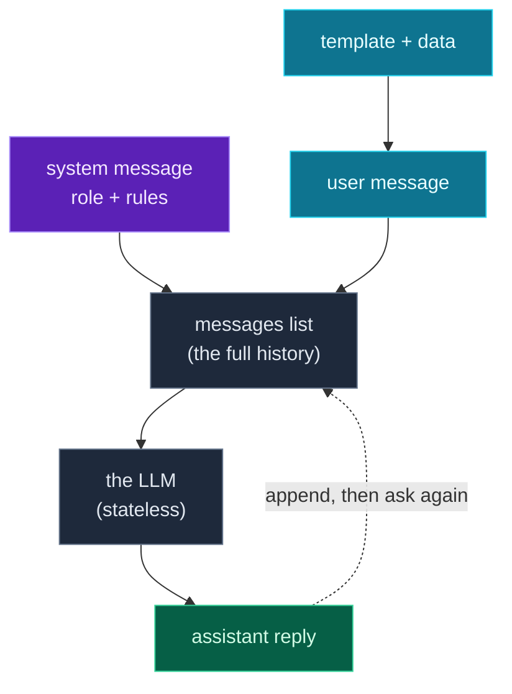

Yesterday you sent a single bare `user` message and got a reply. That works for a one-off, but real AI features need *structure*: a way to set the model's role and rules, to carry a multi-turn conversation, and to reuse prompts instead of hand-writing each one. Today you build that structure in Python — cleanly, with the dataclasses you wrote on Day 12.

You'll learn **system messages** (instructions that shape every reply), how **multi-turn conversations** work (and why the model is *stateless*), reusable **prompt templates** (one prompt, filled with different data), and a small **`Conversation` builder** that assembles messages and hands you the exact list-of-dicts an LLM API expects. The result is the difference between a throwaway script and an AI component you can build on.

> **A member lesson.** Prompt *structure* is where AI engineering really starts — the model is only as good as the messages you send it. We keep it provider-general (it works for Claude, OpenAI, or Gemini) and runnable with the mock from Day 24.

---

## System messages: setting the role

An LLM request isn't just your question — it's a **list of messages**, each with a role. You met the roles on Day 24: **`system`** (instructions and persona), **`user`** (the human), **`assistant`** (the model's prior replies). The **system message** comes first and shapes *everything* the model does:

```python
messages = [
    {"role": "system", "content": "You are a helpful assistant. Answer briefly."},
    {"role": "user", "content": "What is Python?"},
]

for m in messages:
    print(f"{m['role']}: {m['content']}")
```

**Output:**

```text
system: You are a helpful assistant. Answer briefly.
user: What is Python?
```

The system message is your main steering wheel: set the role ("You are a senior Python tutor"), the rules ("Only answer in JSON"), the tone, the constraints. The same question with a different system message gives a very different answer. Most of "prompt engineering" is writing a good system message.

> **One per-provider note:** OpenAI and Gemini take the system instruction *as a message in the list* (as above). Anthropic's SDK takes it as a **separate `system=` argument** to `messages.create(...)` instead. The *concept* — a top-level instruction that shapes the whole reply — is identical; only where it goes in the call differs. Today we model it as a `system` message and note where it splits out.

---

## Multi-turn conversations — and why the model forgets

To have a *conversation*, you keep adding messages: the model's reply becomes an `assistant` message, then you add the next `user` message, and so on. But here's the crucial fact: **the model is stateless.** It remembers nothing between calls. For it to "remember" earlier turns, **you resend the entire message history every time** (just like the stateless APIs from Day 21):

```python
history = [
    {"role": "user", "content": "My name is Ada."},
    {"role": "assistant", "content": "Nice to meet you, Ada!"},
    {"role": "user", "content": "What is my name?"},
]
print(f"{len(history)} messages sent so the model has the context")
```

**Output:**

```text
3 messages sent so the model has the context
```

If you sent only the last message (`"What is my name?"`), the model would have no idea — it never stored "Ada." The whole list goes every call. This is why managing the message list cleanly matters, and why a small helper to build it pays off immediately.

---

## Prompt templates: write once, fill with data

You rarely send a fixed prompt — you send the *same shape* of prompt with different data ("summarize *this*", "translate *that*"). Don't hand-write each one; make a **template**: a function that takes the data and returns the finished prompt (an f-string, Day 2, with a `\n` for spacing, Day 15):

```python
def translate_prompt(text: str, language: str) -> str:
    return f"Translate this into {language}:\n\n{text}"

print(translate_prompt("Hello, world", "French"))
```

**Output:**

```text
Translate this into French:

Hello, world
```

Now every translation request is one clean call — `translate_prompt(user_text, "Spanish")` — with the wording defined in exactly one place. Change the phrasing once and every call improves. This is the DRY principle (Day 5) applied to prompts, and it's how real AI apps keep their prompts consistent and maintainable.

---

## A clean Conversation builder (dataclasses from Day 12)

Building message lists by hand gets messy. Let's wrap it in the `ChatMessage`/`Conversation` dataclasses from Day 12, with helper methods that append a message and return `self` — so you can *chain* them. A `to_messages()` method then converts to the list-of-dicts the API wants:

> Illustration only — the full version is in the project below.
> ```python
> conversation = (
>     Conversation()
>     .system("You are a concise summarization assistant.")
>     .user(summarize_prompt(article, max_words=10))
> )
> messages = conversation.to_messages()   # → the list of {"role", "content"} dicts
> ```

The win: your code reads like the conversation itself (`.system(...).user(...)`), the dataclass keeps each message tidy and type-checked, and `to_messages()` is the single place that knows the provider's wire format. Swap providers and you change `to_messages()` once, not every call site. That separation — *your* clean structure on the inside, the *provider's* format at the boundary — is exactly the discipline from Day 23.

---

## How a structured conversation flows



**Reading this diagram:**

Two things feed the **grey messages list** in the middle — the spine of every LLM call. From the top, the **purple system message** sets the role and rules. From the left, the **cyan boxes** show a `user` message being built from a *template* filled with *data* (the `translate_prompt(...)` / `summarize_prompt(...)` pattern). Both land in the messages list.

That whole list is sent to the **grey "LLM" box** — labelled *stateless* on purpose: the model holds no memory, so the *entire* list goes every time. It produces the **green assistant reply**.

Now the key arrow: the dotted line from the reply *back up* to the messages list, **"append, then ask again."** For a multi-turn conversation you add the assistant's reply (and the next user message) to the same list and send it all again. That loop — build, send, append, repeat — is the shape of every chatbot and agent.

The takeaway: **a system message and templated user messages go into one growing list; the stateless model answers it; you append the answer and loop.** Structure that list well — which is exactly what the `Conversation` builder does — and everything downstream gets easier.

---

## Build it: a prompt builder

Let's assemble a clean, reusable prompt builder — `ChatMessage`/`Conversation` dataclasses, a fluent API, a prompt template, and a multi-turn step — runnable with a mock (no key, no install beyond the standard library). Create **`prompts.py`** in a `day-25` folder:

```python
# prompts.py — structuring prompts & responses (Day 25)
from dataclasses import dataclass, field

@dataclass
class ChatMessage:
    role: str        # "system", "user", or "assistant"
    content: str

@dataclass
class Conversation:
    messages: list[ChatMessage] = field(default_factory=list)

    def system(self, text: str) -> "Conversation":
        self.messages.append(ChatMessage("system", text))
        return self

    def user(self, text: str) -> "Conversation":
        self.messages.append(ChatMessage("user", text))
        return self

    def assistant(self, text: str) -> "Conversation":
        self.messages.append(ChatMessage("assistant", text))
        return self

    def to_messages(self) -> list[dict]:
        """Convert to the list-of-dicts format LLM APIs expect."""
        return [{"role": m.role, "content": m.content} for m in self.messages]


# a reusable prompt TEMPLATE: fill in the blanks with data
def summarize_prompt(text: str, max_words: int = 20) -> str:
    return f"Summarize the following in at most {max_words} words:\n\n{text}"


# a mock LLM that "answers" based on the messages it receives
def ask_mock(messages: list[dict]) -> str:
    last_user = next((m["content"] for m in reversed(messages) if m["role"] == "user"), "")
    return f"(mock) Here is a summary of your {len(last_user.split())}-word request."


# --- using it ---
article = "Python is a high-level language known for readability and a huge ecosystem."

conversation = (
    Conversation()
    .system("You are a concise summarization assistant.")
    .user(summarize_prompt(article, max_words=10))
)

messages = conversation.to_messages()
print("Messages sent to the model:")
for m in messages:
    print(f"  [{m['role']}] {m['content'][:48]}")

reply = ask_mock(messages)
print(f"\nAssistant: {reply}")

# multi-turn: append the reply, then ask a follow-up
conversation.assistant(reply).user("Now make it even shorter.")
print(f"\nConversation now has {len(conversation.messages)} messages (the full history).")
```

**Run it** (`python3 prompts.py` / `python prompts.py`):

```text
Messages sent to the model:
  [system] You are a concise summarization assistant.
  [user] Summarize the following in at most 10 words:

Py

Assistant: (mock) Here is a summary of your 20-word request.

Conversation now has 4 messages (the full history).
```

You built a structured, multi-turn conversation with a system role, a templated user prompt, and a clean provider-ready format — and it runs free against the mock. Swap `ask_mock(messages)` for the real `ask_claude` from Day 24 (passing `conversation.to_messages()`), and it's a real AI feature.

### Understanding the code

- **`ChatMessage` / `Conversation`** are the Day 12 dataclasses — each message is a typed object, and the conversation holds the list.
- **`.system()`, `.user()`, `.assistant()`** each append a message and `return self`, so calls **chain** (`.system(...).user(...)`) and read like the conversation.
- **`to_messages()`** is the single boundary that converts your tidy objects into the provider's list-of-dicts — the one place to adjust per provider.
- **`summarize_prompt(...)`** is a reusable template: the prompt wording lives in one function, filled with data and a default `max_words`.
- **`ask_mock(messages)`** stands in for the real call, reading the messages just like a provider would — so you develop the whole flow for free.
- **The multi-turn step** appends the reply and a follow-up, growing the same history (4 messages) you'd resend next call.

Everything from the series shows up here: dataclasses, type hints, f-strings, default arguments, list handling. Structure is just good Python pointed at prompts.

---

## Common errors and how to fix them

**1. The model ignores my instructions / has no persona**
You didn't include a `system` message (or, on Anthropic, didn't pass `system=`). Add one and be specific about role, rules, and format. The system message is the strongest lever you have over the model's behavior.

**2. The model "forgets" what we were talking about**
You sent only the latest message, not the history. The model is **stateless** — resend the *entire* message list every call. Keep appending to one `Conversation` (or list) and send `to_messages()` each time.

**3. An invalid or misspelled role was rejected**
Roles must be exactly `"system"`, `"user"`, or `"assistant"` (lowercase). `"System"` or `"human"` will error. Build messages through the `Conversation` helpers so the role strings are always correct.

**4. My `system` message "didn't work" on Claude**
Anthropic's SDK doesn't take `system` as a message in the list — it's a **separate `system=` argument** to `messages.create(...)`. Pull the system text out of your list and pass it there: `client.messages.create(system=system_text, messages=user_and_assistant_messages, ...)`.

**5. My prompt template broke on a `{` or `}` in the user's text**
If you build prompts with `.format()` or careless f-strings and the user's text contains literal braces, you can get a `KeyError` or `ValueError`. Insert user text as a *value* (`f"... {text}"` where `text` is the variable), not as part of the format string — never `.format()` untrusted text as the template itself.

**6. I built the prompt as one giant string instead of structured messages**
Concatenating everything into a single string loses the role structure the model relies on (and breaks multi-turn). Keep messages as a *list* of role/content items — that's what the API expects and what lets you carry a conversation.

> **Reading tip:** when a model misbehaves, look at the *messages you actually sent* first (`print(conversation.to_messages())`). Most "the model is wrong" problems are really "the prompt was unstructured or incomplete."

---

## Recap — what you can do now

You can structure prompts like an engineer:

- ✅ **System messages** — set the model's role, rules, and tone.
- ✅ **Multi-turn & statelessness** — resend the full history every call.
- ✅ **Prompt templates** — one reusable function, filled with data (DRY prompts).
- ✅ **A `Conversation` builder** — dataclasses + chained `.system()/.user()/.assistant()`.
- ✅ **`to_messages()`** — your clean structure converted to the provider's format at one boundary.
- ✅ A **provider-ready prompt builder** that runs against the mock.

### Day 25 cheat sheet

| Want to… | Do this |
|---|---|
| Set role/rules | a `system` message (Anthropic: `system=` arg) |
| Ask something | a `user` message |
| Record the reply | an `assistant` message |
| Carry a conversation | resend the **whole** message list |
| Reuse a prompt | a template function: `def make_prompt(data) -> str:` |
| Build messages cleanly | `Conversation().system(...).user(...)` |
| Get API format | `conversation.to_messages()` |
| Inspect what you sent | `print(conversation.to_messages())` |

---

## Coming up on Day 26

So far the model's reply has been free-form text. But for real applications you often need it as **structured data** — a JSON object with specific fields you can use in code. Tomorrow is **parsing structured LLM outputs**: asking the model to return JSON, then parsing and *validating* it with Pydantic (Day 18) — turning an unpredictable text reply into a trusted, typed object, and handling the cases where the model returns something slightly off. It's how you safely connect an LLM to the rest of your program.

You've learned to structure what goes *in*. Next, we structure what comes *out*. See the full roadmap on the [Python for AI Engineering series page](/series/python-for-ai-engineering).

**See you on Day 26.** 🐍
