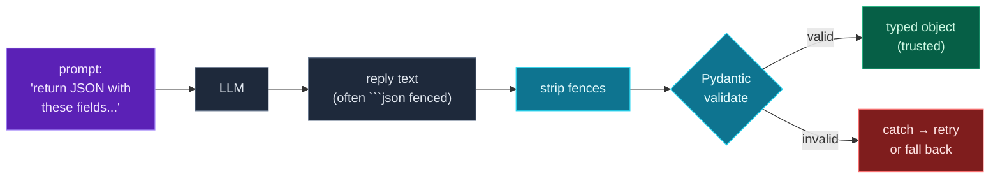

You can call a model and structure what goes *in* (Day 25). But a reply that's a paragraph of prose is hard to *use* in code — you can't reliably pull "the priority" out of a sentence. For real applications you want the model to return **structured data**: a JSON object with specific fields you can read directly. Today you make that happen, and — crucially — make it *safe*.

The flow is everything you've learned, pointed at AI: ask the model for **JSON** (Day 25's prompting), deal with the messy ways models actually return it, then **parse and validate** the result with Pydantic (Day 18) so you get a trusted, typed object instead of a hopeful guess. You'll also handle the reality that models *sometimes return something slightly wrong* — and your program should survive that. This is the bridge from "an LLM said something" to "my program can depend on it."

> **A member lesson.** Structured output + validation is the single most important reliability pattern in AI engineering. The model is probabilistic; your validation layer is what makes the system dependable. Runs free against the mock.

---

## Why structured output

Compare two replies to "extract the support ticket":

- **Free-form:** *"Sure! This looks like a high-priority login bug."* — to use this you'd have to parse English. Fragile and unreliable.
- **Structured:** `{"title": "Login bug", "priority": "high", "category": "bug"}` — `data["priority"]` is right there.

Structured output turns the model into a *component* you can wire into the rest of your program: read fields, store them in a database, branch on them, pass them to another function. The recipe is: **ask for JSON, then validate it.**

---

## Asking for JSON

You get JSON by *instructing* the model — usually in the system message (Day 25). Be explicit about the exact keys and allowed values:

> Illustration only — do not paste.
> ```
> Extract a support ticket from the user's message. Respond with ONLY a JSON
> object with keys: title, priority, category. priority must be one of:
> low, medium, high.
> ```

(Most providers also offer a dedicated "JSON mode" or structured-output feature that *guarantees* valid JSON — worth using in production. But the skill of *validating* what comes back applies either way, so we'll do it by hand to learn the pattern.)

---

## The messy reality: models add fences and prose

Here's the catch that trips up beginners: even when you ask for "only JSON," models frequently wrap it in a **markdown code fence**, like ` ```json ... ``` `, or add a sentence around it. So the raw reply isn't valid JSON as-is — you have to clean it first. A small helper strips the fences:

```python
def strip_fences(text: str) -> str:
    text = text.strip()
    if text.startswith("```"):
        lines = text.splitlines()
        if lines and lines[0].startswith("```"):
            lines = lines[1:]
        if lines and lines[-1].strip() == "```":
            lines = lines[:-1]
        text = "\n".join(lines)
    return text.strip()

print(repr(strip_fences('```json\n{"ok": true}\n```')))
```

**Output:**

```text
'{"ok": true}'
```

It drops the opening ` ```json ` line and the closing ` ``` `, leaving raw JSON. Defensive cleanup like this — anticipating the *forms* a model's output can take — is normal and expected when consuming LLM responses.

---

## Parse and validate with Pydantic

Once you have clean JSON text, don't just `json.loads` it and hope — **validate it** into a Pydantic model (Day 18), exactly as you validated API responses on Day 23. This guarantees the fields exist and have the right types, and rejects anything off. Pydantic's **`model_validate_json`** parses *and* validates in one step:

```python
from pydantic import BaseModel

class Person(BaseModel):
    name: str
    age: int

p = Person.model_validate_json('{"name": "Ada", "age": "36"}')   # "36" coerced to int
print(p, "| age type:", type(p.age).__name__)
```

**Output:**

```text
name='Ada' age=36 | age type: int

```

(That prints `name='Ada' age=36 | age type: int`.) The model is now a trusted object — `p.age` is *guaranteed* an int. For LLM output specifically, use Pydantic types that encode your rules: a **`Literal["low", "medium", "high"]`** field rejects a model that returns `"URGENT"`, catching a wrong value at the boundary instead of letting it flow downstream.

---

## Survive a bad response

The model is probabilistic — sometimes it returns invalid JSON, a missing field, or a value outside your allowed set. Your code must **not crash** on that. Wrap the parse-and-validate in `try`/`except` (catching `ValidationError`, and `ValueError` for malformed JSON), and decide what to do — log it, return `None`, retry, or fall back:

```python
from pydantic import ValidationError

def safe_extract(raw: str) -> Person | None:
    try:
        return Person.model_validate_json(raw)
    except (ValidationError, ValueError) as e:
        print(f"Rejected: {str(e).splitlines()[0]}")
        return None
```

In production you'd often **retry** (ask the model again, perhaps with the error message) before giving up — but the core discipline is the same: never trust raw model output; validate, and handle failure gracefully.

---

## The structured-output pipeline



**Reading this diagram:**

Read left to right — it's Day 25's prompt feeding into Day 23's validation gate, with one extra cleanup step in between.

The **purple prompt** instructs the model to return JSON with specific fields. The **grey LLM box** produces a **reply** — but note the label: *often ```json fenced*. That's the messy reality; the raw text usually isn't pure JSON.

So the next **cyan box** is **strip fences** — the cleanup that turns ` ```json {...} ``` ` into raw `{...}`. Then comes the **cyan diamond**, Pydantic **validate**, the same gate from Day 23: it parses the JSON *and* checks every field's type and rules.

Two outcomes. Valid data reaches the **green box** — a typed, trusted object your program can rely on completely. Invalid data (bad JSON, missing field, a value like `"URGENT"` outside your `Literal`) goes to the **red box** — caught, so you can **retry or fall back** instead of crashing.

The takeaway: **ask for JSON → clean it → validate it → trust it (or recover).** The model is unpredictable; this pipeline is what makes the *system* dependable. Never skip the validate step — it's the line between a demo and software.

---

## Build it: a robust ticket extractor

Let's build the full pipeline — extract a structured support ticket from text, clean and validate it, and handle bad responses. Runs against a mock. Install Pydantic, then create **`extract.py`** in a `day-26` folder:

```bash
python3 -m venv .venv && source .venv/bin/activate    # Windows: .venv\Scripts\Activate.ps1
pip install pydantic
```

```python
# extract.py — parse & validate structured LLM output (Day 26)
from typing import Literal
from pydantic import BaseModel, ValidationError

class Ticket(BaseModel):
    title: str
    priority: Literal["low", "medium", "high"]   # only these are valid
    category: str

SYSTEM = (
    "Extract a support ticket from the user's message. "
    "Respond with ONLY a JSON object with keys: title, priority, category. "
    "priority must be one of: low, medium, high."
)

def ask_mock(user_text: str) -> str:
    """A mock LLM: returns JSON wrapped in a markdown fence (like real models often do)."""
    return (
        "```json\n"
        '{"title": "Login button broken", "priority": "high", "category": "bug"}\n'
        "```"
    )

def strip_fences(text: str) -> str:
    """Models often wrap JSON in ```json ... ``` — strip that to get raw JSON."""
    text = text.strip()
    if text.startswith("```"):
        lines = text.splitlines()
        if lines and lines[0].startswith("```"):
            lines = lines[1:]
        if lines and lines[-1].strip() == "```":
            lines = lines[:-1]
        text = "\n".join(lines)
    return text.strip()

def extract_ticket(raw: str) -> Ticket:
    cleaned = strip_fences(raw)
    return Ticket.model_validate_json(cleaned)   # parse JSON + validate in one step

# --- using it ---
reply = ask_mock("The login button doesn't work, it's urgent!")
ticket = extract_ticket(reply)
print(f"Parsed ticket: {ticket}")
print(f"  Title: {ticket.title}")
print(f"  Priority: {ticket.priority} (a trusted, validated value)")

# robustly handle a model that returns broken or invalid output
def safe_extract(raw: str) -> Ticket | None:
    try:
        return extract_ticket(raw)
    except (ValidationError, ValueError) as e:
        print(f"  Rejected: {str(e).splitlines()[0]}")
        return None

print("\n--- bad priority value (model returned 'URGENT') ---")
safe_extract('{"title": "Oops", "priority": "URGENT", "category": "bug"}')

print("\n--- not JSON at all ---")
safe_extract("Sure! Here is your ticket: it's a high priority bug.")
```

**Run it** (`python extract.py`):

```text
Parsed ticket: title='Login button broken' priority='high' category='bug'
  Title: Login button broken
  Priority: high (a trusted, validated value)

--- bad priority value (model returned 'URGENT') ---
  Rejected: 1 validation error for Ticket

--- not JSON at all ---
  Rejected: 1 validation error for Ticket
```

The good reply — fences and all — was cleaned, validated, and turned into a trusted `Ticket`. The two bad ones (an out-of-range priority and plain prose) were *rejected cleanly* instead of crashing the program. That robustness is the whole point.

### Understanding the code

- **`Ticket` with `priority: Literal[...]`** encodes your rules in the type — the model *must* return one of the three allowed values or validation fails.
- **`ask_mock`** returns fenced JSON on purpose, mimicking how real models reply (swap in `ask_claude` from Day 24 to go live).
- **`strip_fences`** handles the markdown-fence reality before parsing.
- **`extract_ticket`** uses **`model_validate_json`** to parse *and* validate in one step — clean JSON in, trusted `Ticket` out (or a `ValidationError`).
- **`safe_extract`** wraps it in `try`/`except` so a malformed or off-spec reply is caught and handled, never crashing the run.
- **Both failure cases** — a bad `Literal` value and non-JSON text — are rejected with a clear message, exactly the resilience real AI apps need.

This extract → clean → validate → recover pattern is how every production LLM feature turns unpredictable text into dependable data.

---

## Common errors and how to fix them

**1. `json.decoder.JSONDecodeError` / `ValidationError` on the model's reply**
The reply wasn't pure JSON — usually wrapped in a ` ```json ` fence or surrounded by prose. Strip fences first (and tighten the prompt to "respond with ONLY JSON"). If it persists, `print(repr(raw))` to see exactly what the model sent.

**2. The model returned a value outside my allowed set (e.g. `"URGENT"`)**
Free-text fields accept anything. Use `Literal[...]` (or a Pydantic `enum`/`Field` constraint, Day 18) so off-spec values are *rejected* at validation, and list the allowed values explicitly in your prompt.

**3. A missing field crashed my code**
You read the dict directly instead of validating. Validate into a Pydantic model — missing required fields raise a `ValidationError` you can catch, rather than a surprise `KeyError` later.

**4. One bad response crashed the whole batch**
You didn't wrap parsing in `try`/`except`. Catch `ValidationError` (and `ValueError`) around the validate step; in a loop, log/skip the bad one and keep going (Day 13 + Day 23 discipline).

**5. The model added extra keys I didn't expect**
Pydantic ignores unknown fields by default (Day 23), so this usually just works — you get the fields you declared. Use `extra="forbid"` only if you specifically want to reject unexpected keys.

**6. I trusted `json.loads(...)` output without validating**
Parsing isn't validating — `json.loads` gives you a dict of *whatever* the model sent, including wrong types and missing fields. Always pass it through a Pydantic model before your program depends on it.

> **Reading tip:** when extraction fails, look at the *raw* model output first (`print(repr(raw))`). Most failures are formatting (fences/prose) or a single off-spec value — both visible immediately, and both handled by clean-then-validate.

---

## Recap — what you can do now

You can turn LLM replies into dependable data:

- ✅ **Ask for JSON** — explicit keys and allowed values in the prompt.
- ✅ **Clean the reply** — strip markdown fences and surrounding prose.
- ✅ **Validate with Pydantic** — `model_validate_json`, with `Literal`/constraints encoding your rules.
- ✅ **Survive bad output** — `try`/`except` around the validate, then retry or fall back.
- ✅ The mindset — **never trust raw model output**; validate at the boundary.
- ✅ A **robust extractor** that turns messy replies into trusted `Ticket` objects.

### Day 26 cheat sheet

| Want to… | Do this |
|---|---|
| Get JSON from a model | instruct "respond with ONLY JSON" + keys |
| Encode allowed values | `priority: Literal["low","medium","high"]` |
| Strip code fences | drop ` ```json ` / ` ``` ` lines |
| Parse + validate | `Model.model_validate_json(text)` |
| Catch bad output | `except (ValidationError, ValueError):` |
| Recover | return `None`, log, or retry |
| Inspect raw output | `print(repr(raw))` |

---

## Coming up on Day 27 — closing Module 9

You now have every piece of an AI feature: keys, the LLM call, structured prompts, and validated output. Tomorrow you **assemble them into a real CLI tool** — a command-line AI program you run like any other. You'll meet **`argparse`** (Python's standard way to handle command-line arguments), wire together the env, the LLM client (mock or real), Pydantic validation, and logging into one polished, reusable tool. It's the capstone of Module 9 — the moment all the AI-workflow skills become a thing you can actually ship.

You've learned to trust the output. Next, we package it into a tool. See the full roadmap on the [Python for AI Engineering series page](/series/python-for-ai-engineering).

**See you on Day 27.** 🐍
