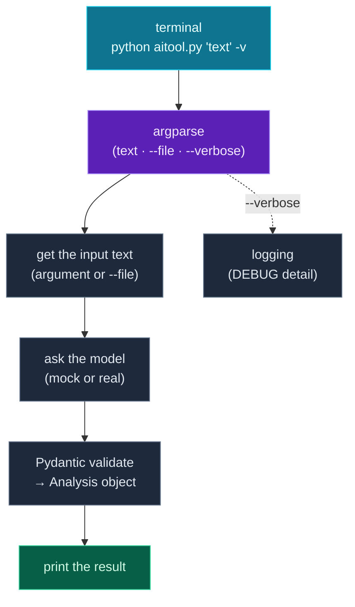

You now have every ingredient of an AI feature: keys from `.env`, the LLM call, structured prompts, validated output. Today — the finale of **Module 9** — you combine them into something you can actually *use*: a **command-line tool**. Not a snippet in a tutorial, but a real program you run from your terminal like `python aitool.py "some text"`, the same way you run `python`, `pip`, and `git`.

The one new piece is **`argparse`**, Python's standard library for handling command-line arguments — it parses what the user types, generates a `--help` screen for free, and reports errors cleanly. Around it you'll wire together the whole series: functions and modules (Days 5–6), a Pydantic model (Days 18, 26), logging (Day 14), error handling (Day 13), and the LLM-with-mock pattern (Day 24). The result is a polished, shippable AI tool — and proof of how far you've come.

> **A member lesson — Module 9 finale.** This is where the skills become a *thing*. Build it, run it from your terminal, point it at your own text. It runs free against the mock; swap in a real model when you have a key.

---

## What makes a CLI tool

A command-line (CLI) tool is a program you invoke from the terminal, usually with **arguments** and **options**:

```text
python aitool.py "I love this product!"      # an argument
python aitool.py --file review.txt           # an option that takes a value
python aitool.py --verbose "great"           # a flag
python aitool.py --help                       # the built-in help
```

Your job is to read those inputs, do the work, and print a result (and exit with a status code). `argparse` handles the reading and the help; you supply the work.

---

## argparse: reading command-line arguments

You create a parser, declare the arguments you accept, and call `parse_args()`. There are two kinds of arguments: **positional** (`text`) and **optional** (`--file`, `--verbose`):

```python
import argparse

parser = argparse.ArgumentParser(description="Analyze the sentiment of some text.")
parser.add_argument("text", nargs="?", help="the text to analyze")        # positional (optional with nargs="?")
parser.add_argument("-f", "--file", help="read the text from a file instead")  # optional, takes a value
parser.add_argument("-v", "--verbose", action="store_true", help="show debug logs")  # a flag (true/false)
args = parser.parse_args()
```

After `parse_args()`, the values are attributes: `args.text`, `args.file`, `args.verbose`. Three things to note: `nargs="?"` makes a positional argument *optional*; `action="store_true"` makes `--verbose` a flag that's `True` when present and `False` otherwise; and every argument's `help` text is collected into an **auto-generated `--help` screen** — you never write usage docs by hand. `argparse` also validates input and prints clean errors for free.

---

## Assembling the tool

The tool's logic is a pipeline you already know: get the input text (from an argument or a file), send it to the model (the mock from Day 24), **validate** the reply into a Pydantic model (Day 26), and print the result. Logging (Day 14) reports what's happening, and `--verbose` turns up the detail:

```python
class Analysis(BaseModel):
    sentiment: Literal["positive", "neutral", "negative"]
    summary: str

def analyze(text: str) -> Analysis:
    logger.debug("Sending %d characters to the model", len(text))
    raw = ask_mock(text)                       # the LLM call (mock or real)
    return Analysis.model_validate_json(raw)   # parse + validate (Day 26)
```

Each piece is a skill from earlier in the series; the tool is just them composed. That's the whole idea of *engineering* — small, proven parts assembled into something useful.

---

## The tool's architecture



**Reading this diagram:**

Read top to bottom — it's the flow of one command, and every box is a skill from the series clicking into place.

It starts at the **cyan terminal box**: the user types `python aitool.py 'text' -v`. That goes into the **purple argparse box**, which parses the raw command line into clean values — the `text`, the optional `--file`, the `--verbose` flag — and would print `--help` or an error if the input were wrong.

From there the **grey boxes** are the pipeline: *get the input text* (from the argument, or by reading the `--file`), *ask the model* (the mock today, a real LLM with a key), and *validate* the reply into a typed `Analysis` object (Day 26's gate — so the result is trustworthy). That lands in the **green box**: print the result.

The dotted arrow off to the side is **logging** — `--verbose` flips the log level to DEBUG so you can watch what the tool is doing, without changing the main flow. It runs alongside everything, exactly as Day 14 described.

The takeaway: **a CLI tool is argparse at the front, your pipeline in the middle, a printed result at the end — with logging watching the whole thing.** None of the boxes are new; the achievement is that they now form a complete, runnable program. That's the shape of essentially every command-line tool you'll ever build.

---

## Build it: a text-analysis CLI tool

Let's build the whole thing — a real command-line AI tool. Install Pydantic, then create **`aitool.py`** in a `day-27` folder:

```bash
python3 -m venv .venv && source .venv/bin/activate    # Windows: .venv\Scripts\Activate.ps1
pip install pydantic
```

```python
# aitool.py — a command-line AI tool (Day 27: capstone of Module 9)
import argparse
import logging
from typing import Literal
from pydantic import BaseModel, ValidationError

logging.basicConfig(level=logging.WARNING, format="%(levelname)s | %(message)s")
logger = logging.getLogger(__name__)


class Analysis(BaseModel):
    sentiment: Literal["positive", "neutral", "negative"]
    summary: str


def ask_mock(text: str) -> str:
    """Mock LLM: returns a structured analysis as JSON (swap in a real call from Day 24)."""
    low = text.lower()
    if "love" in low or "great" in low:
        sentiment = "positive"
    elif "hate" in low or "bad" in low:
        sentiment = "negative"
    else:
        sentiment = "neutral"
    return f'{{"sentiment": "{sentiment}", "summary": "A {len(text.split())}-word note."}}'


def analyze(text: str) -> Analysis:
    logger.debug("Sending %d characters to the model", len(text))
    raw = ask_mock(text)
    logger.debug("Raw model output: %s", raw)
    return Analysis.model_validate_json(raw)


def main():
    parser = argparse.ArgumentParser(description="Analyze the sentiment of some text.")
    parser.add_argument("text", nargs="?", help="the text to analyze")
    parser.add_argument("-f", "--file", help="read the text from a file instead")
    parser.add_argument("-v", "--verbose", action="store_true", help="show debug logs")
    args = parser.parse_args()

    if args.verbose:
        logger.setLevel(logging.DEBUG)

    if args.file:
        with open(args.file) as f:
            text = f.read()
    elif args.text:
        text = args.text
    else:
        parser.error("provide some text, or use --file")

    try:
        result = analyze(text)
    except (ValidationError, ValueError) as e:
        logger.error("Could not analyze: %s", str(e).splitlines()[0])
        raise SystemExit(1)

    print(f"Sentiment: {result.sentiment}")
    print(f"Summary:   {result.summary}")


if __name__ == "__main__":
    main()
```

**Run it** — it's a real command-line program now:

```text
$ python aitool.py "I love this product, it's great!"
Sentiment: positive
Summary:   A 6-word note.

$ python aitool.py "This is bad, I hate it."
Sentiment: negative
Summary:   A 6-word note.

$ python aitool.py -v "great stuff"
DEBUG | Sending 11 characters to the model
DEBUG | Raw model output: {"sentiment": "positive", "summary": "A 2-word note."}
Sentiment: positive
Summary:   A 2-word note.
```

And the help screen `argparse` generated for free (`python aitool.py --help`):

```text
usage: aitool.py [-h] [-f FILE] [-v] [text]

Analyze the sentiment of some text.

positional arguments:
  text                  the text to analyze

options:
  -h, --help            show this help message and exit
  -f FILE, --file FILE  read the text from a file instead
  -v, --verbose         show debug logs
```

That's a genuine tool. It takes input from an argument or a file, calls the model, validates the result, logs on request, and exits cleanly. Swap `ask_mock` for `ask_claude` (Day 24) and it's a real AI utility you could install and use every day.

### Understanding the code

- **`argparse`** declares a positional `text`, an optional `--file`, and a `--verbose` flag — and hands you `args.text`, `args.file`, `args.verbose`, plus a free `--help`.
- **`Analysis` (Pydantic + `Literal`)** is the validated output contract (Day 26) — the result is a trusted, typed object, not raw text.
- **`analyze`** is the pipeline: log, call the model (mock), validate. **`ask_mock`** stands in for the LLM so it runs free.
- **Input handling** reads from `--file` or the argument, and **`parser.error(...)`** reports a missing input the standard CLI way (with usage + a non-zero exit).
- **`try`/`except` + `raise SystemExit(1)`** make the tool fail cleanly with a non-zero exit code on bad output — exactly how command-line programs signal failure.
- **`logging` + `--verbose`** give you diagnostics on demand (Day 14), and **`if __name__ == "__main__":`** (Day 6) makes it run as a program but stay importable.

Every layer is a day from this series. The capstone isn't new material — it's the *assembly*, which is the real skill.

---

## Common errors and how to fix them

**1. `error: the following arguments are required: ...` / my tool needs an argument**
`argparse` enforces required arguments and prints usage automatically (exit code 2). If an argument should be optional, add `nargs="?"` (positional) or make it an option (`--name`). Use `parser.error("message")` for your own custom "you must provide X" messages.

**2. `FileNotFoundError` when using `--file`**
The path the user passed doesn't exist. Check it with `Path(args.file).exists()` (Day 15) before opening, and print a friendly message (`parser.error(f"no such file: {args.file}")`) instead of a raw traceback.

**3. `--verbose` did nothing / no logs appear**
You set up `logging` but didn't raise the level — the default is `WARNING`, so `DEBUG`/`INFO` are hidden (Day 14). Call `logger.setLevel(logging.DEBUG)` when `args.verbose` is true, as the project does.

**4. My tool printed a traceback instead of exiting cleanly**
An unhandled exception dumps a traceback and exits with a confusing status. Catch expected failures (`ValidationError`, `FileNotFoundError`) and `raise SystemExit(1)` with a logged message — that's the clean, conventional way for a CLI to fail.

**5. `AttributeError: 'Namespace' object has no attribute 'text'`**
You referenced an argument name that doesn't match what you declared. `args.<name>` uses the long option name (`--file` → `args.file`, `--verbose` → `args.verbose`). Match the attribute to the `add_argument` name (dashes become underscores).

**6. I want short *and* long flags**
Pass both to `add_argument`: `add_argument("-v", "--verbose", ...)`. The value is stored under the long name (`args.verbose`). Reserve single letters for the common options; `-h`/`--help` is taken automatically.

> **Reading tip:** when a CLI misbehaves, run it with `--help` first — `argparse` shows exactly which arguments and flags exist and how they're spelled. Most CLI bugs are a mismatched argument name or a missing `nargs`/`action`.

---

## Recap — Module 9 complete 🎉

You can build a real AI tool:

- ✅ **`argparse`** — positional args, options, flags, and a free `--help`.
- ✅ **Assembled pipeline** — input → LLM call → Pydantic validation → output.
- ✅ **Logging + `--verbose`** — diagnostics on demand.
- ✅ **Clean failure** — `parser.error`, `try`/`except`, `SystemExit(1)`, exit codes.
- ✅ **The mock-or-real pattern** — ships and runs today; goes live with a key.
- ✅ A **complete CLI AI tool** combining the whole series.

Across Module 9 you went from your first LLM call, through structured prompts and validated output, to a tool you can actually run — the full arc of an AI workflow.

### Day 27 cheat sheet

| Want to… | Write |
|---|---|
| Make a parser | `argparse.ArgumentParser(description=...)` |
| Positional arg | `parser.add_argument("text")` |
| Optional positional | `add_argument("text", nargs="?")` |
| Option with value | `add_argument("-f", "--file")` |
| A flag (true/false) | `add_argument("-v", action="store_true")` |
| Read the values | `args = parser.parse_args()` → `args.file` |
| Custom error | `parser.error("message")` |
| Fail with status | `raise SystemExit(1)` |
| Run-as-program | `if __name__ == "__main__": main()` |

---

## Coming up on Day 28 — the final module begins

You've built AI applications on top of models. The last module looks *underneath* them. **Module 10 — Data & ML Foundations** is the bridge to actual machine learning, and Day 28 starts with **NumPy and tensor intuition**: arrays, vectorized math that's far faster than loops, shapes and dtypes, and the mental model of a **tensor** — the multi-dimensional array that *is* the data inside every neural network. It's the groundwork that makes PyTorch, TensorFlow, and Hugging Face make sense.

You've learned to *use* AI. Next, we look at the data it's made of. See the full roadmap on the [Python for AI Engineering series page](/series/python-for-ai-engineering).

**See you on Day 28.** 🐍
