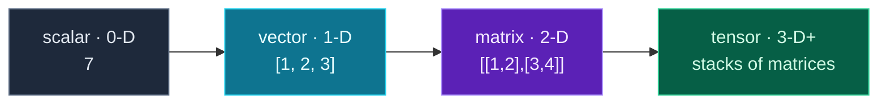

You've spent this series building *on top of* AI models. The final module — **Module 10, Data & ML Foundations** — looks *underneath* them, at the data machine learning is actually made of. And it all starts with one library: **NumPy**.

NumPy provides the **array** — a fast, multi-dimensional grid of numbers — and it's the bedrock of the entire Python data and AI stack. Pandas, scikit-learn, PyTorch, TensorFlow, Hugging Face — every one is built on NumPy arrays (or things shaped just like them). Today you'll learn arrays, **vectorized** math (doing arithmetic on whole arrays at once, far faster than loops), and the crucial mental model of a **tensor**: the scalar → vector → matrix → tensor ladder that *is* the data flowing through a neural network. This is the groundwork that makes PyTorch and friends finally make sense.

> **A member lesson — the home stretch.** You don't need any maths beyond what you know. NumPy is just lists of numbers with superpowers. Run every snippet; the "aha" is seeing math happen on a whole array at once.

---

## Why NumPy? Lists are slow for math

A Python list can hold numbers, but doing math on it means looping — and for large data, that's slow. NumPy stores numbers in a compact array and runs operations in optimized C under the hood, so the *same* computation is dramatically faster. Here's the difference, summing a million squares:

```python
import numpy as np, time

n = 1_000_000
t0 = time.perf_counter()
total = sum(i * i for i in range(n))          # Python loop
print(f"python loop: {(time.perf_counter()-t0)*1000:.0f} ms")

a = np.arange(n)
t0 = time.perf_counter()
total_np = (a * a).sum()                       # NumPy, vectorized
print(f"numpy:       {(time.perf_counter()-t0)*1000:.0f} ms")
```

**Output:**

```text
python loop: 39 ms
numpy:       1 ms
```

NumPy was *tens of times* faster (your exact numbers will vary). And notice it's not just faster — `(a * a).sum()` is *shorter and clearer* than a loop. That combination, speed plus expressiveness, is why all of data science runs on it.

---

## Arrays: the basics

Create an array from a list with `np.array(...)`. An array knows its **shape** (the size of each dimension), its number of dimensions (**ndim**), and its element type (**dtype**):

```python
import numpy as np

a = np.array([1, 2, 3, 4])
print(a, "| shape:", a.shape, "| dtype:", a.dtype)
```

**Output:**

```text
[1 2 3 4] | shape: (4,) | dtype: int64
```

You'll also build arrays without a starting list — handy for initialising data:

```python
print(np.zeros(3))            # [0. 0. 0.]
print(np.ones(3))             # [1. 1. 1.]
print(np.arange(0, 10, 2))    # [0 2 4 6 8]  (like range, but an array)
print(np.linspace(0, 1, 5))   # [0. 0.25 0.5 0.75 1.] (5 evenly spaced points)
```

`zeros`/`ones` make filled arrays, `arange` is NumPy's `range`, and `linspace` gives evenly spaced points (great for plotting, Day 30).

---

## Vectorized operations: math without loops

The superpower: arithmetic and functions apply to **every element at once** — no loop. This is "vectorization," and it's both the fast way and the readable way:

```python
arr = np.array([1, 2, 3, 4])
print(arr * 2)                 # multiply every element
print(arr + arr)               # element-wise add
print(np.sqrt(np.array([1, 4, 9, 16])))  # a function over the whole array
```

**Output:**

```text
[2 4 6 8]
[2 4 6 8]
[1. 2. 3. 4.]
```

Write the operation on the *whole array* and NumPy does the looping for you, fast. This is how all numerical code is written — you'll almost never write an explicit loop over array elements.

### Aggregations

Collapse an array to a summary with `sum`, `mean`, `max`, `min` — and for 2D data, control the direction with **`axis`** (`axis=0` works *down* the columns, `axis=1` *across* the rows):

```python
data = np.array([[5.1, 3.5, 1.4],
                 [4.9, 3.0, 1.4]])
print("overall mean:", data.mean())
print("column means:", data.mean(axis=0))   # one mean per column
```

**Output:**

```text
overall mean: 3.2166666666666663
column means: [5.   3.25 1.4 ]
```

`axis` is the one concept worth pinning down: in a rows-are-samples, columns-are-features table (exactly how ML data is shaped), `axis=0` gives you a statistic *per feature*.

---

## The tensor ladder

Here's the intuition that unlocks deep learning. An array can have any number of dimensions, and each step up the ladder has a name:



**Reading this diagram:**

Read left to right — each step adds one dimension, and the names are the vocabulary of all of machine learning.

The **grey box** is a **scalar**: a single number, zero dimensions. The **cyan box** is a **vector**: a 1-D list of numbers — say, one data sample's features, or a word's embedding. The **purple box** is a **matrix**: a 2-D grid — a whole table of samples × features, or a grayscale image of pixels. The **green box** is a **tensor**: 3-D or higher — a stack of matrices, like a colour image (height × width × 3 colour channels), or a *batch* of images.

The key realisation: **these aren't four different things — they're the same thing (an array) at different dimensions.** "Tensor" is just the general word for "array of any number of dimensions," and `array.ndim` tells you which rung you're on. The data flowing through a neural network *is* tensors: inputs, weights, activations, outputs — all multi-dimensional arrays. **A NumPy array literally is a tensor** (a CPU one). PyTorch and TensorFlow tensors are the very same idea, with two extras bolted on — they can live on a **GPU** for speed, and they track gradients for training. Learn NumPy arrays and you've learned tensors; the frameworks just add the ML machinery.

---

## Build it: vectorized stats on a small dataset

Let's treat an array as a real dataset — rows are samples, columns are features (the universal ML layout) — and compute stats and normalise it, all vectorized. Install NumPy, then create **`arrays.py`** in a `day-28` folder:

```bash
python3 -m venv .venv && source .venv/bin/activate    # Windows: .venv\Scripts\Activate.ps1
pip install numpy
```

```python
# arrays.py — NumPy arrays & tensor intuition (Day 28)
import numpy as np

# a tiny dataset: 4 samples, 3 features (rows x columns) — a 2-D tensor
data = np.array([
    [5.1, 3.5, 1.4],
    [4.9, 3.0, 1.4],
    [6.7, 3.1, 5.6],
    [6.0, 3.0, 4.8],
])

print("shape:", data.shape, "| dims:", data.ndim, "| dtype:", data.dtype)

# vectorized: double every value, no loop needed
print("doubled[0]:", (data * 2)[0])

# per-column stats (axis=0 → down the columns / features)
print("feature means:", data.mean(axis=0).round(2))
print("feature maxes:", data.max(axis=0))

# normalize each feature to 0..1: (x - min) / (max - min), all vectorized
mins = data.min(axis=0)
maxs = data.max(axis=0)
normalized = (data - mins) / (maxs - mins)
print("\nnormalized:\n", normalized.round(2))

# indexing
print("\nsample 2 (a row):", data[2])
print("feature 0 (a column):", data[:, 0])

# the tensor ladder
scalar = np.array(7)                  # 0-D
vector = np.array([1, 2, 3])          # 1-D
matrix = np.array([[1, 2], [3, 4]])   # 2-D
print("\ndims -> scalar:", scalar.ndim, "vector:", vector.ndim,
      "matrix:", matrix.ndim, "data:", data.ndim)
```

**Run it** (`python arrays.py`):

```text
shape: (4, 3) | dims: 2 | dtype: float64
doubled[0]: [10.2  7.   2.8]
feature means: [5.68 3.15 3.3 ]
feature maxes: [6.7 3.5 5.6]

normalized:
 [[0.11 1.   0.  ]
 [0.   0.   0.  ]
 [1.   0.2  1.  ]
 [0.61 0.   0.81]]

sample 2 (a row): [6.7 3.1 5.6]
feature 0 (a column): [5.1 4.9 6.7 6. ]

dims -> scalar: 0 vector: 1 matrix: 2 data: 2
```

Every line is a core data move: the **shape** `(4, 3)` says 4 samples × 3 features; `data.mean(axis=0)` gives a stat *per feature*; the normalization `(data - mins) / (maxs - mins)` rescales every feature to 0–1 in one vectorized expression; and `data[:, 0]` pulls out a single feature column.

### Understanding the code

- **`data.shape` = `(4, 3)`** — the universal ML layout: rows are samples, columns are features. `ndim` is `2` (a matrix / 2-D tensor).
- **`data * 2`** doubles every element with no loop — vectorization.
- **`data.mean(axis=0)`** computes one mean *per column* (per feature); `axis=0` is "down the rows."
- **`(data - mins) / (maxs - mins)`** is **normalization** done with **broadcasting**: `mins` and `maxs` are 1-D (one value per feature), and NumPy automatically applies them across every row. One line replaces a double loop.
- **`data[2]`** is a row (a sample); **`data[:, 0]`** is a column (a feature) — `:` means "all rows."
- **The ladder** prints `0, 1, 2, 2` — scalar, vector, matrix, and our data, by dimension count.

Normalizing features, computing per-column stats, slicing rows and columns — this *is* the data-prep work that precedes every model. And it's all just arrays.

---

## Common errors and how to fix them

**1. `ModuleNotFoundError: No module named 'numpy'`**
NumPy isn't installed in your active venv. Run `pip install numpy` (the conventional import is `import numpy as np`).

**2. `ValueError: operands could not be broadcast together with shapes (3,) (2,)`**
You did math on two arrays whose shapes don't line up — e.g. adding a length-3 and a length-2 array. Operations need compatible shapes; print `a.shape` and `b.shape` and make them match (or rely on broadcasting only when one dimension is 1 or the value is a scalar).

**3. My integers turned into floats (or got truncated)**
NumPy arrays have a single `dtype`. `np.array([1,2,3])` is `int64`; dividing it gives a `float64` result. If you assign a float *into* an int array, it's truncated. Create the array with the dtype you want (`np.array([1,2,3], dtype=float)`) when it matters.

**4. `axis` gave me the wrong direction**
`axis=0` aggregates *down the columns* (one result per column); `axis=1` aggregates *across the rows* (one result per row). For per-feature stats on a samples×features table, you want `axis=0`. When confused, check the shape of the result.

**5. `IndexError: too many indices for array`**
You indexed with more dimensions than the array has — e.g. `arr[0, 1]` on a 1-D array. Use `arr[i]` for 1-D and `arr[row, col]` for 2-D; `arr.ndim` tells you how many indices it takes.

**6. I wrote a Python loop over array elements**
It works, but it throws away NumPy's speed. Replace element-by-element loops with vectorized operations (`arr * 2`, `arr + other`, `np.sqrt(arr)`, `arr.sum(axis=...)`). If you're looping over a NumPy array doing math, there's almost always a vectorized one-liner.

> **Reading tip:** most NumPy errors are about **shape**. When something breaks, print `.shape` on the arrays involved — a mismatch or an unexpected dimension is the cause nine times out of ten.

---

## Recap — what you can do now

You've got the foundation under all of data and ML:

- ✅ **Arrays** — `np.array`, `shape`/`ndim`/`dtype`, and `zeros`/`ones`/`arange`/`linspace`.
- ✅ **Vectorized math** — operate on whole arrays at once (fast and clear).
- ✅ **Aggregations** — `sum`/`mean`/`max` with `axis` for per-feature stats.
- ✅ **Indexing** — rows (`data[i]`), columns (`data[:, j]`), and broadcasting.
- ✅ **Tensor intuition** — scalar → vector → matrix → tensor; arrays *are* tensors.
- ✅ A **vectorized data-prep** script: stats and normalization on a real dataset shape.

### Day 28 cheat sheet

| Want to… | Write |
|---|---|
| Make an array | `np.array([1, 2, 3])` |
| Filled / ranged arrays | `np.zeros(n)` / `np.arange(a, b)` / `np.linspace(a, b, n)` |
| Its shape / dims / type | `a.shape` / `a.ndim` / `a.dtype` |
| Math on all elements | `a * 2`, `a + b`, `np.sqrt(a)` |
| Summaries | `a.sum()` / `a.mean()` / `a.max()` |
| Per-column (per-feature) | `a.mean(axis=0)` |
| A row / a column | `a[i]` / `a[:, j]` |
| Reshape | `a.reshape(rows, cols)` |

---

## Coming up on Day 29

NumPy arrays are powerful but bare — just numbers, no labels. Real datasets have named columns, mixed types, and missing values, and live in CSV files. Tomorrow is **Pandas**: the `DataFrame` — a labelled, spreadsheet-like table built on NumPy — and how to **load a dataset** from CSV, inspect it (`head`, `info`, `describe`), select and filter rows and columns, and group and summarise. It's the tool every data scientist reaches for first, and the practical layer on top of today's arrays.

You've learned the array. Next, we give it labels and load real data. See the full roadmap on the [Python for AI Engineering series page](/series/python-for-ai-engineering).

**See you on Day 29.** 🐍
