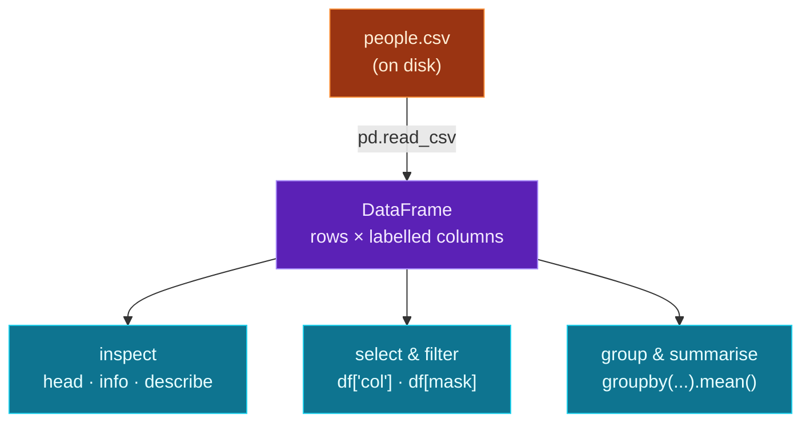

NumPy arrays (Day 28) are fast, but bare: just numbers, no labels. Real datasets aren't like that — they have *named* columns, *mixed* types (text and numbers together), missing values, and they arrive as **CSV files**. The tool that handles all of this is **Pandas**, and its star is the **DataFrame**: a labelled, spreadsheet-like table built on top of NumPy. It's the single most-used tool in data science, and the first thing anyone reaches for when a dataset shows up.

Today you'll load a real dataset from a CSV, **inspect** it (the first thing you always do), **select and filter** rows and columns, **add computed columns**, and **group and summarise** — the everyday moves of data analysis. If NumPy gave you the engine, Pandas is the dashboard: the practical, labelled layer you'll actually work in.

> **A member lesson — almost there.** Pandas feels like a programmable spreadsheet, and that intuition is exactly right. Run every snippet; you'll be analysing a dataset in a dozen lines.

---

## DataFrame and Series

A **DataFrame** is a table — rows and named columns. Each column is a **Series** (a labelled 1-D array — NumPy underneath). You'll usually load a DataFrame from a file, but you can build one from a dict of columns:

```python
import pandas as pd

df = pd.DataFrame({"name": ["Ada", "Linus"], "age": [36, 52]})
print(df)
print("type of df['name']:", type(df["name"]).__name__)
```

**Output:**

```text
    name  age
0    Ada   36
1  Linus   52
type of df['name']: Series
```

The DataFrame prints like a spreadsheet, with an automatic row **index** (`0, 1, ...`) on the left. Pull out one column with `df["name"]` and you get a **Series**. That's the whole vocabulary: a DataFrame is a collection of Series sharing an index.

---

## Loading a dataset from CSV

Real data lives in files. **`pd.read_csv(path)`** reads a CSV straight into a DataFrame, inferring column names from the header and types from the values:

> File: `people.csv`
> ```
> name,age,city,salary
> Ada,36,London,85000
> Linus,52,Helsinki,95000
> Grace,45,New York,90000
> Alan,41,London,78000
> Margaret,38,New York,82000
> ```

```python
df = pd.read_csv("people.csv")
```

One line and you have the whole dataset as a DataFrame. (Pandas also reads Excel, JSON, SQL, and more — `read_csv` is just the most common.)

---

## Inspect first — always

Before analysing anything, *look* at it. These four are the reflex every data scientist runs first:

```python
print(df.shape)        # (rows, columns)
print(df.columns)      # the column names
print(df.head(3))      # the first few rows
print(df.describe())   # quick stats for numeric columns
```

`describe()` is especially useful — count, mean, std, min/max, and quartiles for every numeric column at once:

```python
print(df[["age", "salary"]].describe().round(1))
```

**Output:**

```text
        age   salary
count   5.0      5.0
mean   42.4  86000.0
std     6.3   6670.8
min    36.0  78000.0
25%    38.0  82000.0
50%    41.0  85000.0
75%    45.0  90000.0
max    52.0  95000.0
```

(`df.info()` is the fifth reflex — it shows column types and how many non-missing values each has, which is how you spot missing data.) Always inspect before you compute; it catches surprises early.

---

## Selecting, filtering, and computing

Pull out columns, and filter rows with a **boolean mask** — `df[condition]` keeps only the rows where the condition is true:

```python
print(df["age"].mean())                 # a stat on one column
print(df[df["age"] > 40]["name"])       # names of people over 40
```

`df["age"] > 40` produces a Series of `True`/`False`, and `df[that]` keeps the matching rows — the same comprehension-style filtering from Day 9, now on a whole table. Add a **computed column** by assigning to a new name; it's vectorized (NumPy underneath, Day 28):

```python
df["salary_k"] = df["salary"] / 1000    # every row at once, no loop
```

And count categories with **`value_counts()`**:

```python
print(df["city"].value_counts())
```

**Output:**

```text
city
London      2
New York    2
Helsinki    1
Name: count, dtype: int64
```

Select, filter, compute, count — these four cover most of day-to-day data work.

---

## Grouping: split, apply, combine

The most powerful move is **`groupby`** — split the data into groups, apply a calculation to each, and combine the results. "Average salary *by city*" is one line:

```python
print(df.groupby("city")["salary"].mean())
```

It groups the rows by `city`, takes the `salary` of each group, and computes the mean per group. This split-apply-combine pattern answers most analytical questions ("sales by region," "average score by class," "count by category") and is the heart of data analysis.

---

## The shape of a Pandas workflow



**Reading this diagram:**

Read top to bottom — it's the arc of essentially every data analysis you'll ever do.

It begins at the **orange box**: a CSV file on disk, your raw dataset. **`pd.read_csv`** loads it into the **purple DataFrame** — a labelled table of rows and named columns, the central object you work with.

From there, three **cyan boxes** are the core moves, and you do them in this order. First **inspect** (`head` / `info` / `describe`) — *always* look before you leap, to understand the shape, types, and any missing values. Then **select & filter** (`df['col']`, `df[mask]`) — narrow to the rows and columns you care about. Then **group & summarise** (`groupby(...).mean()`) — split the data by a category and compute per-group answers.

The takeaway: **load → inspect → select/filter → group/summarise.** That sequence, on a DataFrame, is the daily rhythm of data work — and it's exactly what the project does. Everything more advanced (joins, time series, pivot tables) is built on these same foundations.

---

## Build it: load and analyse a dataset

Let's run the full workflow on a real CSV. Install Pandas, create the data file and the script in a `day-29` folder.

```bash
python3 -m venv .venv && source .venv/bin/activate    # Windows: .venv\Scripts\Activate.ps1
pip install pandas
```

> File: `people.csv`
> ```
> name,age,city,salary
> Ada,36,London,85000
> Linus,52,Helsinki,95000
> Grace,45,New York,90000
> Alan,41,London,78000
> Margaret,38,New York,82000
> ```

```python
# analyze.py — load & explore a dataset with Pandas (Day 29)
import pandas as pd

# 1) load a CSV into a DataFrame
df = pd.read_csv("people.csv")

# 2) inspect it
print("shape:", df.shape)
print("columns:", list(df.columns))
print("\nfirst 3 rows:")
print(df.head(3))

# 3) a single column is a Series; compute on it
print("\naverage age:", df["age"].mean())
print("average salary:", round(df["salary"].mean()))

# 4) filter with a boolean mask: people over 40
print("\nover 40:")
print(df[df["age"] > 40][["name", "age"]])

# 5) add a computed column (vectorized, NumPy under the hood)
df["salary_k"] = df["salary"] / 1000

# 6) group + summarize: average salary by city
print("\naverage salary by city:")
print(df.groupby("city")["salary"].mean())
```

**Run it** (`python analyze.py`):

```text
shape: (5, 4)
columns: ['name', 'age', 'city', 'salary']

first 3 rows:
    name  age      city  salary
0    Ada   36    London   85000
1  Linus   52  Helsinki   95000
2  Grace   45  New York   90000

average age: 42.4
average salary: 86000

over 40:
    name  age
1  Linus   52
2  Grace   45
3   Alan   41

average salary by city:
city
Helsinki    95000.0
London      81500.0
New York    86000.0
Name: salary, dtype: float64
```

In a dozen lines you loaded a dataset, inspected it, computed stats, filtered to a subset, added a feature, and produced a grouped summary — the complete shape of real analysis.

### Understanding the code

- **`pd.read_csv("people.csv")`** loads the file into a DataFrame, with column names from the header and types inferred (`age`/`salary` numeric, `name`/`city` text).
- **`df.shape` / `df.columns` / `df.head(3)`** — inspect first: dimensions, names, a peek at the rows.
- **`df["salary"].mean()`** computes on a single column (a Series) — vectorized, like NumPy.
- **`df[df["age"] > 40]`** filters with a boolean mask, then `[["name", "age"]]` selects two columns — the two operations compose.
- **`df["salary_k"] = df["salary"] / 1000`** adds a computed column, applied to every row at once.
- **`df.groupby("city")["salary"].mean()`** is split-apply-combine — the per-city averages that answer the real question.

Loading, inspecting, filtering, and grouping a dataset *is* the bulk of practical data science — and it's the step that precedes feeding data into any model.

---

## Common errors and how to fix them

**1. `ModuleNotFoundError: No module named 'pandas'`**
Pandas isn't installed in your active venv. Run `pip install pandas` (the conventional import is `import pandas as pd`; it pulls in NumPy automatically).

**2. `FileNotFoundError` from `read_csv`**
The path is wrong — `read_csv` looks relative to where you *run* the script (Day 16). Run from the folder with the CSV, or pass an absolute path; check with `Path("people.csv").exists()` first.

**3. `KeyError: 'Age'`**
You used a column name that doesn't exist — usually a case or spelling mismatch (`"Age"` vs `"age"`). Print `df.columns` to see the exact names, including any stray spaces.

**4. `SettingWithCopyWarning` when adding/changing a column**
You assigned to a *slice* of the DataFrame (e.g. after a filter) rather than the frame itself, and Pandas warns the change might not stick. Work on the full frame, or make an explicit copy first: `subset = df[df["age"] > 40].copy()`, then modify `subset`.

**5. `df["col"]` vs `df[["col"]]` confused me**
Single brackets `df["col"]` give a **Series** (one column); double brackets `df[["col"]]` give a **DataFrame** (a table with one column). Use double brackets `df[["a", "b"]]` to select *multiple* columns.

**6. My numeric column is being treated as text**
A stray non-numeric value (or thousands separators/currency symbols) makes Pandas read the whole column as text (`object` dtype), so `.mean()` fails or concatenates. Check `df.info()` for the dtype, clean the values, or convert with `pd.to_numeric(df["col"], errors="coerce")`.

> **Reading tip:** when Pandas surprises you, run `df.info()` and `df.head()`. Most issues are a wrong column name, an unexpected dtype, or missing values — all of which those two calls reveal instantly.

---

## Recap — what you can do now

You can work with real datasets:

- ✅ **DataFrame & Series** — labelled tables and columns, built on NumPy.
- ✅ **Load a CSV** — `pd.read_csv` straight into a DataFrame.
- ✅ **Inspect** — `shape`, `columns`, `head`, `describe`, `info`.
- ✅ **Select & filter** — columns, boolean masks, computed columns.
- ✅ **Summarise** — `mean`, `value_counts`, and `groupby` split-apply-combine.
- ✅ A full **load → inspect → filter → group** analysis in a dozen lines.

### Day 29 cheat sheet

| Want to… | Write |
|---|---|
| Load a CSV | `pd.read_csv("file.csv")` |
| Dimensions / columns | `df.shape` / `df.columns` |
| Peek / stats / types | `df.head()` / `df.describe()` / `df.info()` |
| One column (Series) | `df["age"]` |
| Several columns | `df[["name", "age"]]` |
| Filter rows | `df[df["age"] > 40]` |
| New computed column | `df["x2"] = df["x"] * 2` |
| Count categories | `df["city"].value_counts()` |
| Group & summarise | `df.groupby("city")["salary"].mean()` |

---

## Coming up on Day 30 — the finale 🎉

Tomorrow is **Day 30** — the last day, and the **capstone**. You'll **visualise** data with matplotlib (turning a dataset into a chart you save to a file), pull together loading, analysis, and plotting into one end-to-end mini-project, and we'll step back to see *why* everything in this module — NumPy, Pandas, plotting — is the essential groundwork *before* PyTorch, TensorFlow, and Hugging Face. Then: where to go next, after 30 days of Python.

You've learned to wrangle data. Next, we picture it — and finish the journey. See the full roadmap on the [Python for AI Engineering series page](/series/python-for-ai-engineering).

**See you on Day 30 — the finale.** 🐍
