This is it — **Day 30, the finale.** Thirty days ago you installed Python and printed your first line. Today you finish the foundations of data and AI engineering, and you do it with a real **capstone**: load a dataset, analyse it, and turn it into a chart you can save and share — the complete arc of practical data work in one small program.

You'll learn to **visualise** data with matplotlib (a picture finds patterns a table hides), assemble loading, analysis, and plotting into one end-to-end project, and understand *why* this whole module — NumPy, Pandas, plotting — is the groundwork that makes PyTorch, TensorFlow, and Hugging Face comprehensible. Then we'll step back, look at how far you've come, and point you at what's next. Let's finish strong.

> **The last member lesson. 🎉** You've earned this one. Run the capstone, open the chart it makes, and take a moment — you went from zero to AI-ready Python in thirty days. That's a real accomplishment.

---

## Plotting with matplotlib

A chart reveals what a column of numbers can't. **matplotlib** is the foundational plotting library (Pandas' own plots are built on it). Install it, and the basic flow is: make a plot, label it, and — since a script has no window to pop up — **save it to a file**:

```python
import matplotlib
matplotlib.use("Agg")            # "save to a file" mode, for scripts
import matplotlib.pyplot as plt

plt.plot([1, 2, 3, 4], [1, 4, 9, 16])   # a line chart
plt.title("Squares")
plt.savefig("line.png")                  # write the image to disk
```

That produces a `line.png` file. The common chart types are `plt.plot` (line — trends over time), `plt.bar` (bars — comparing categories), and `plt.scatter` (points — relationships between two variables). The **`matplotlib.use("Agg")`** line tells matplotlib to render to a *file* rather than try to open a window — exactly what you want in a script (use it before importing `pyplot`).

### Plotting straight from Pandas

Even simpler: a Pandas Series or DataFrame can plot *itself*, calling matplotlib under the hood. `series.plot(kind="bar")` turns a grouped summary into a bar chart in one line — which is exactly what the capstone does:

```python
by_city.plot(kind="bar")     # a Series → a bar chart
plt.savefig("chart.png")
```

This is the everyday way to visualise: do your analysis in Pandas (Day 29), then `.plot(...)` the result and `savefig` it.

---

## Why this is the groundwork for PyTorch, TensorFlow & Hugging Face

It's worth saying plainly, because it's the point of the whole module. When you eventually open PyTorch or Hugging Face, you won't meet alien concepts — you'll meet *these*:

- **Models eat tensors.** A neural network's input, weights, and output are all **tensors** — the multi-dimensional arrays you learned on Day 28. PyTorch and TensorFlow tensors are NumPy arrays with a GPU and gradient-tracking bolted on. The mental model is identical.
- **Data prep is Pandas + NumPy.** Before any model trains, the data is loaded, cleaned, filtered, and shaped with Pandas and NumPy (Days 28–29). That's most of the actual work in machine learning.
- **You inspect and visualise constantly.** You plot the data before training to understand it, and the results after, to see if the model worked (Day 30). Matplotlib is everywhere in ML notebooks.

So this module isn't a detour from AI — it's the *floor* it stands on. The frameworks add the learning machinery; the foundation is what you built this week. That's why we end here: you're now ready to pick those frameworks up and have them make sense.

---

## The 30-day journey

```mermaid
flowchart LR
    M1["Basics\n1–6"] --> M2["Pythonic Data\n7–9"] --> M3["OOP\n10–12"] --> M4["Robust Code\n13–15"] --> M5["Envs\n16"]
    M5 --> M6["Type Safety\n17–18"] --> M7["Async\n19–20"] --> M8["APIs\n21–23"] --> M9["AI Workflows\n24–27"] --> M10["Data & ML\n28–30"]
    M10 --> Done["AI-Ready Python\n→ PyTorch · TensorFlow · Hugging Face"]

    classDef early fill:#0e7490,stroke:#22d3ee,color:#e8feff
    classDef mid fill:#5b21b6,stroke:#a78bfa,color:#f3e8ff
    classDef late fill:#9a3412,stroke:#fb923c,color:#ffedd5
    classDef done fill:#065f46,stroke:#34d399,color:#d1fae5
    class M1,M2,M3,M4,M5 early
    class M6,M7,M8,M9,M10 mid
    class Done done
```



**Reading this diagram:**

This is the whole path you walked — read it left to right, because each step genuinely built on the one before.

The **cyan boxes** are the foundations: the **basics** (1–6) gave you variables, collections, control flow, functions, and modules; **Pythonic data** (7–9) added comprehensions and the sort/filter/map toolkit; **OOP** (10–12) let you model with classes and dataclasses; **robust code** (13–15) made your programs handle errors, log, and persist; and **environments** (16) made projects reproducible.

The **purple boxes** are where it turned toward AI: **type safety** (17–18) with hints and Pydantic; **async** (19–20) for fast, concurrent I/O; **APIs** (21–23) to talk to real services; **AI workflows** (24–27) to call LLMs, structure prompts, validate outputs, and ship a CLI tool; and **data & ML foundations** (28–30) — NumPy, Pandas, and plotting.

Every box fed the next: dataclasses (Day 12) structured your chat messages (Day 25); Pydantic (Day 18) validated your API *and* LLM responses (Days 23, 26); async (Day 20) is how you'd scale those LLM calls; NumPy (Day 28) underlies Pandas (Day 29) and the charts here. Nothing was isolated.

And they all converge on the **green box**: **AI-Ready Python.** You don't just know syntax — you can build typed, validated, async, API-driven, AI-powered programs, and you have the data foundations to step into PyTorch, TensorFlow, and Hugging Face. That's the journey, and you finished it.

---

## Build it: the capstone

One last project — and it uses the whole final module at once: load a dataset (Day 29), analyse it (Days 28–29), and visualise it as a saved chart (Day 30). Install the libraries, create the data and the script in a `day-30` folder.

```bash
python3 -m venv .venv && source .venv/bin/activate    # Windows: .venv\Scripts\Activate.ps1
pip install matplotlib pandas
```

> File: `people.csv`
> ```
> name,age,city,salary
> Ada,36,London,85000
> Linus,52,Helsinki,95000
> Grace,45,New York,90000
> Alan,41,London,78000
> Margaret,38,New York,82000
> ```

```python
# capstone.py — the 30-day capstone: load, analyze, visualize (Day 30)
import matplotlib
matplotlib.use("Agg")          # save to a file instead of opening a window (for scripts)
import matplotlib.pyplot as plt
import pandas as pd

# 1) LOAD the dataset (Day 29)
df = pd.read_csv("people.csv")
print(f"Loaded {len(df)} records, {df.shape[1]} columns.")

# 2) ANALYZE: average salary by city, highest first (Days 28-29)
by_city = df.groupby("city")["salary"].mean().sort_values(ascending=False)
print("\nAverage salary by city:")
print(by_city.round(0))

# 3) VISUALIZE: a bar chart, saved to a file (Day 30)
by_city.plot(kind="bar", color="#22d3ee")
plt.title("Average Salary by City")
plt.ylabel("Salary")
plt.xticks(rotation=0)
plt.tight_layout()
plt.savefig("salary_by_city.png", dpi=100)
print("\nSaved chart to salary_by_city.png")
```

**Run it** (`python capstone.py`):

```text
Loaded 5 records, 4 columns.

Average salary by city:
city
Helsinki    95000.0
New York    86000.0
London      81500.0
Name: salary, dtype: float64

Saved chart to salary_by_city.png
```

Open **`salary_by_city.png`** — there's your data as a clean bar chart, Helsinki tallest. In one short program you loaded a real dataset, computed a grouped summary, and produced a shareable visualisation: the complete data pipeline, end to end. *That's* data engineering, and you just did it.

### Understanding the code

- **`matplotlib.use("Agg")`** (before importing `pyplot`) puts matplotlib in file-output mode — right for scripts, which have no display window.
- **`pd.read_csv` → `df`** loads the dataset (Day 29); `len(df)` and `df.shape` confirm what you got.
- **`df.groupby("city")["salary"].mean().sort_values(...)`** is the analysis — split-apply-combine (Day 29) plus a sort, producing the per-city averages.
- **`by_city.plot(kind="bar", ...)`** turns that Series straight into a bar chart; `title`/`ylabel`/`xticks`/`tight_layout` make it readable.
- **`plt.savefig("salary_by_city.png", dpi=100)`** writes the image to disk — the deliverable.

Load, analyse, visualise, save — that's the shape of every data report, dashboard, and ML exploration you'll ever build.

---

## Common errors and how to fix them

**1. `ModuleNotFoundError: No module named 'matplotlib'`**
It isn't installed in your active venv. Run `pip install matplotlib` (the conventional import is `import matplotlib.pyplot as plt`).

**2. My script makes no chart / hangs on `plt.show()`**
In a script there's no GUI window. Use `matplotlib.use("Agg")` (before importing `pyplot`) and **`plt.savefig("file.png")`** to write an image, instead of `plt.show()`. (`show()` is for interactive notebooks.)

**3. The saved image is blank**
You called `savefig` *after* `plt.show()` (which clears the figure), or before you plotted anything. Plot first, then `savefig`. When drawing several charts, `plt.clf()` (clear figure) between them.

**4. Labels are cut off or overlapping**
The figure is too cramped. Call `plt.tight_layout()` before saving, and rotate crowded x-axis labels with `plt.xticks(rotation=45)` (or `0` to keep them horizontal).

**5. `FileNotFoundError` from `read_csv`**
The CSV path is relative to where you *run* the script (Day 16). Run from the folder containing `people.csv`, or use an absolute path.

**6. The chart looks wrong / unordered**
A chart only shows what you give it. Group, aggregate, and sort the data *before* plotting (`.sort_values(...)`) so the bars are in a meaningful order — the analysis is what makes the picture useful.

> **Reading tip:** for plotting, the usual fix is the backend (`Agg` + `savefig` for scripts) and the order of calls (plot → label → `tight_layout` → `savefig`). Get those right and matplotlib is smooth.

---

## Recap — you did it 🎉

In thirty days, you went from never having written code to building real AI-ready Python. Look at everything you now have:

- ✅ **The basics** — variables, collections, loops, functions, modules (Days 1–6).
- ✅ **Pythonic data** — comprehensions, nested data, sort/filter/map/reduce (Days 7–9).
- ✅ **OOP** — classes, inheritance, dataclasses, and when to use them (Days 10–12).
- ✅ **Robust code** — exceptions, logging, files, and `.env` config (Days 13–15).
- ✅ **Pro setup** — virtual environments, pip, project structure (Day 16).
- ✅ **Type safety** — type hints + mypy, and Pydantic validation (Days 17–18).
- ✅ **Async** — `async`/`await`, concurrency, and where it matters for AI (Days 19–20).
- ✅ **APIs** — `requests`, async `httpx`, secure keys, validated responses (Days 21–23).
- ✅ **AI workflows** — calling LLMs, structured prompts, parsing output, a CLI tool (Days 24–27).
- ✅ **Data & ML foundations** — NumPy tensors, Pandas, and plotting (Days 28–30).

You can write programs that are typed, validated, asynchronous, API-driven, AI-powered, and data-literate. That's not "beginner Python" anymore — that's the real toolkit of an AI engineer.

### The 30-day cheat sheet

| Layer | You can now… |
|---|---|
| Language | model anything with functions, classes, and modules |
| Data | wrangle, validate, and reshape it (comprehensions, Pydantic, NumPy, Pandas) |
| Reliability | handle errors, log, persist, and reproduce environments |
| Speed | run I/O concurrently with async |
| The world | call any API — and any LLM — securely |
| AI | structure prompts, validate outputs, and ship AI tools |

---

## Where to go from here

You've finished the foundation. Here's how to build on it:

- **Build things.** The fastest way to cement this is to make something you care about — a CLI AI tool, a small data analysis, an API client. Pick a project and use the skills.
- **Pick up a framework.** With tensors, data handling, and Python fluency, you're ready for **PyTorch**, **TensorFlow**, or **Hugging Face** — and they'll finally make sense, because you have the groundwork.
- **Go deeper on AI engineering.** RAG, agents, evals, and production LLM patterns are the natural next step now that you can call models, structure prompts, and validate output.
- **Keep the habits.** Virtual environments, type hints, validation, error handling, and clear structure — the discipline matters more than any one library.

Thirty days ago, this was a goal. Now it's a skill you own. **There is no Day 31 — because you don't need one.** You have everything you need to keep going on your own, and the whole field of AI engineering is open in front of you.

Thank you for spending these thirty days here. Now go build something. The next series picks up where this leaves off — see what's next on the [Python for AI Engineering series page](/series/python-for-ai-engineering).

**Congratulations — you're an AI-ready Python developer.** 🐍🎉
